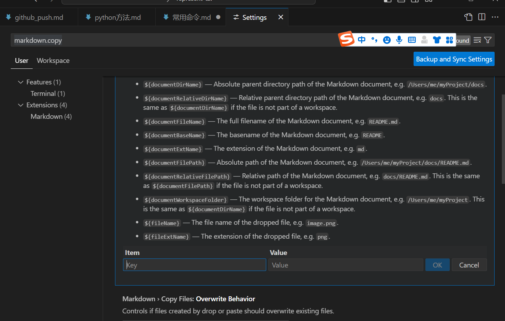

# kill 显存   
sudo fuser -v /dev/nvidia*  
找到COMMAND=python的，然后通过以下命令逐一kill僵尸进程    
sudo kill -9 进程q

## 多卡 多进程 一次性杀掉
sudo lsof /dev/nvidia* | grep python | awk '{print $2}' | xargs sudo kill -9

    sudo lsof /dev/nvidia*：列出所有打开 /dev/nvidia* 设备的进程。注意，在一些系统上可能是 sudo lsof +D /dev/nvidia*，具体取决于 lsof 的版本和用法。
    grep python：从 lsof 的输出中筛选出包含 python 的行，即与 Python 相关的进程。
    awk '{print $2}'：使用 awk 打印每行的第二个字段，这通常是进程ID（PID）。
    xargs sudo kill -9：将 awk 的输出（即 PID 列表）作为 kill -9 命令的参数，强制杀掉这些进程。-9 选项发送 SIGKILL 信号，该信号不能被捕获、阻塞或忽略，因此可以强制终止进程。
注意：使用 kill -9 强制杀掉进程可能会导致数据丢失或不一致的状态，特别是如果进程正在执行重要任务或持有重要资源时。尽可能先尝试使用 kill（不带 -9）来优雅地终止进程，如果不起作用再考虑使用 kill -9。

另外，确保你确实想要杀掉这些进程，因为这将影响正在运行的程序或服务。如果 python 进程是某个重要服务的一部分，直接杀掉它们可能会导致服务中断。

                        USER        PID ACCESS COMMAND
    /dev/nvidia0:        root     kernel mount /dev/nvidia0
    /dev/nvidia1:        root     kernel mount /dev/nvidia1
    /dev/nvidia2:        root     kernel mount /dev/nvidia2
    /dev/nvidia3:        root     kernel mount /dev/nvidia3
    /dev/nvidia4:        root     kernel mount /dev/nvidia4
    /dev/nvidia5:        root     kernel mount /dev/nvidia5
    /dev/nvidia6:        root     kernel mount /dev/nvidia6
    /dev/nvidia7:        root     kernel mount /dev/nvidia7
    /dev/nvidiactl:      root     kernel mount /dev/nvidiactl
    /dev/nvidia-uvm:     root     kernel mount /dev/nvidia-uvm
    /dev/nvidia-uvm-tools:
                        root     kernel mount /dev/nvidia-uvm-tools

确实干净

## py程序内 torch
torch.cuda.empty_cache()    
torch.cuda.ipc_collect()

import gc
gc.collect()

import gc 导入 Python 的垃圾收集器模块，而 gc.collect() 是调用该模块的 collect 函数，用于手动触发垃圾收集。这通常用于在需要时清理未使用的内存，尽管在大多数情况下，Python 的自动垃圾收集机制足以处理内存管理。

## 单卡
你在你notebook里执行 fuser -v /dev/nvidia5 就能看到上面的进程

然后用ps -ef | grep {pid}，看看进程是不是还在

## sudo: fuser: command not found

解决：
apt-get install  psmisc
若出现：
Unable to locate package XXX
则：
apt-get update

进程查看 ps -ef

gunicorn启动的kill不干净

要终止使用 nohup 启动的 gunicorn 程序，可以通过以下步骤来完成：

查找进程 ID (PID)：首先，需要查找 gunicorn 进程的进程 ID。可以使用 ps 命令来列出当前运行的进程，并通过关键字 gunicorn 来过滤出相关的进程信息：

    bash
    复制代码
    ps aux | grep gunicorn
这会显示出包含 gunicorn 关键字的进程列表，包括它们的进程 ID（PID）。

终止进程：一旦找到了 gunicorn 进程的 PID，可以使用 kill 命令来终止它。假设找到的 PID 是 1234，则可以使用以下命令杀死该进程：

    bash
    复制代码
    kill 1234

# bash复制子集到另外文件夹

    # 假设源文件夹是/path/to/source，目标文件夹是/path/to/destination  
    # 并且我们想要复制前五个jpg或png图片  
    
    # 查找jpg和png文件，基于文件名排序，然后只选择前五个，并使用xargs来复制它们  
    find /path/to/source -type f \( -iname "*.jpg" -o -iname "*.png" \) | sort | head -n 5 | xargs -I {} cp {} /path/to/destination/

这里的命令解释如下：

find /path/to/source -type f \( -iname "*.jpg" -o -iname "*.png" \)：在指定源文件夹中查找所有jpg和png文件。
sort：将找到的文件名按字典顺序排序。
head -n 5：只保留排序后的前五个文件名。
xargs -I {} cp {} /path/to/destination/：对于head命令输出的每个文件名（通过{}替换），执行cp命令将其复制到目标文件夹。
请注意，这种方法可能不适用于所有情况，特别是如果你的图片文件名不是以字典顺序组织的（例如，如果它们是用时间戳命名的）。在这种情况下，你可能需要更复杂的脚本来处理时间戳排序或基于其他标准的排序。

另外，如果你的系统上有大量的图片文件，使用find命令可能需要一些时间来处理所有文件。在这种情况下，考虑使用更高效的搜索或排序方法，或者将图片文件组织在更容易管理的子文件夹中。

## bash查看当前文件夹容量大小

.venv 有时候是这个占空间 但是以下命令看不到

查看当前目录总共占的容量：
du -sh

查看当前目录下每个子目录的容量：
du -sh ./*

查看当前目录及其所有子目录的容量：
du -ach ./*

这些命令中的 -h 参数会以人类可读的格式（如K，M，G）显示容量，-s 参数则仅显示总计123。

你可以使用 du 命令结合 sort 命令来查看当前目录下子目录的大小，并按从大到小排序。以下是具体的命令：

du -sh ./* | sort -hr

|：管道符，将前一个命令的输出传递给下一个命令。
sort -hr：按数值大小排序，并以逆序（从大到小）显示结果123。

# bash查看文件数量

查看当前目录下的文件数量（不包括子目录）

    ls -l | grep -v '^d' | wc -l
这个命令通过 ls -l 列出当前目录下的所有文件和目录的详细信息，然后通过 grep -v '^d' 排除以 d 开头的行（即目录），最后 wc -l 计算剩余的行数，即文件的数量。

2. 查看当前目录下的文件和子目录总数
    
    ls -lA | wc -l

这里，ls -lA 列出当前目录下的所有文件和目录（包括隐藏文件，但不包括 . 和 ..），然后 wc -l 计算行数。由于每行代表一个文件或目录，因此这个命令给出的是文件和子目录的总数。

## 文件内行数统计
cat a.txt | wc -l

# 查看NPU信息：
npu-smi info

watch -n 0.5 npu-smi info

16卡 910B 65G

## 连续删除 pid

for pid in $(seq 998 1005); do kill -9 $pid; done

seq 999 1005：生成从 999 到 1005 的连续数字序列。

    for i in {0..3}  
    do  
    kill -9 ${i}
    done  

## 其他cpu查看

查看CPU信息：
lscpu
1
该命令将会列出服务器的CPU信息，包括型号、频率、核心数等。

查看内存信息：
free -h
1
该命令将会列出服务器的内存信息，包括总内存容量、已使用内存容量、可用内存容量等。

查看硬盘信息：
lsblk
1
该命令将会列出服务器的硬盘信息，包括硬盘类型、容量、挂载点等。

查看RAID卡信息：
lspci | grep -i raid
1
该命令将会列出服务器的RAID卡信息，包括型号、厂商等。

查看网卡和光模块信息：
sudo lshw -class network
1
该命令将会列出服务器的网卡和光模块信息，包括型号、速率、驱动程序等。如果您想要查看特定的网卡信息，可以使用以下命令：

ethtool ethX
1
其中，ethX是您想要查看的网卡名称，例如eth0或者eth1等。

# 服务器网页映射本地
端口转发？    

准确说是本地转发   
把本地主机端口通过待登录主机端口转发到远程主机端口上去。   

ssh -L [本地端口]:[远程地址]:[远程端口] [用户]@[服务器地址   
例如：ssh -L 8080:127.0.0.1:80  user@example.co    

不设置本地地址就默认是 127.0.0.1    
或者 http://localhost:8080   

不如设置心跳时间   
ssh -o ServerAliveInterval=60 -L  8080:127.0.0.1:80  user@example.co    

-L 必须紧跟端口 -o必须在前面     

不要使用这个    
ssh -NfL 12500:127.0.0.1:7860 root@hz-t3.matpool.com -p 26368    
-f 会让SSH进入后台。    
-N 表示不执行远程命令，只做端口转发。     
缺陷：不好取消改端口    

ssh -L 8080:0.0.0.0:11223 root@hz-t3.matpool.com    
ssh -L 8080:0.0.0.0:11223 root@hz-t3.matpool.com -p 29705   
直接就登录了     
macbook还是比较不一样的，既能登录又能映射     

vscode自己就帮忙映射本地，但是有时会有问题，网页加载不出      
可能是主机代理原因？     
还得用网页jupyter+本地terminal      
主机代理还导致给飞书上传不了大图片   

其他转发还有    
远程转发是指把登录主机所在网络中某个端口通过本地主机端口转发到远程主机上。

动态转发

# bash
## 串联

& 用于在后台运行命令。
&& 用于串联命令，使得只有当前一个命令成功执行（即返回退出状态 0）时，后一个命令才会执行。

    #!/bin/bash  
    
    # 创建 Conda 环境  
    conda create -n wiseft python=3.8 -y &&  
    
    # 注意：这里不能直接使用 conda activate 加上 &&，因为 activate 是一个 shell 函数  
    # 改用 conda run 或直接指定环境路径中的 pip  
    conda run -n wiseft --no-capture-output pip install torch==2.0.1 torchvision==0.15.2 torchaudio==2.0.2 &&  
    conda run -n wiseft --no-capture-output pip install scikit-learn open_clip_torch &&  
    conda run -n wiseft --no-capture-output pip install numpy wandb torch-geometric torch_scatter pyyaml psutil wilds matplotlib  
    
    # 如果上面的命令中有任何一个失败了，脚本就会停止执行

# 终端python代码查看python版本

python -V

# tmux
tmux kill-session -t edm2  
tmux attach -t edm2   
tmux new-session -s edm2   

## 安装
sudo apt install tmux -y

如果安装不了 使用 sudo apt update       
但是不能用 && 连接安装

## 删除 Ctrl+b : , killw
删除窗口：
当你不在想要删除的窗口中时，可以通过以下方式之一来删除它：
通过命令：首先，按下Ctrl+b，然后输入:进入命令模式，输入kill-window（或者简写为killw），然后按空格键，最后输入你想要删除的窗口的编号或名称（如果你知道的话），最后按Enter键。如果你不知道具体的编号或名称，可以先通过Ctrl+b然后按w来查看。

## tmux 内切换

1. 使用Ctrl+b作为前缀键
在tmux中，Ctrl+b是默认的前缀键，用于激活tmux的快捷键模式。按下Ctrl+b后，你可以再按下其他键来执行不同的操作。

切换到指定编号的窗口：按下Ctrl+b后，再按下窗口的编号（如0、1、2等），即可切换到对应的窗口。注意，窗口编号通常从0开始。
切换到下一个窗口：按下Ctrl+b后，再按下n键，即可切换到下一个窗口。
切换到上一个窗口：按下Ctrl+b后，再按下p键，即可切换到上一个窗口。
2. 使用窗口列表选择
如果你不确定要切换到的窗口编号，或者想要更直观地选择窗口，可以使用窗口列表功能。

按下Ctrl+b后，再按下w键，会列出当前所有打开的窗口。然后，你可以使用上下箭头键在列表中移动，选择你想要切换到的窗口。选择好后，按下回车键即可切换到该窗口。
3. 使用其他快捷键
除了上述方法外，tmux还提供了一些其他与窗口切换相关的快捷键：

在前后两个窗口间互相切换：按下Ctrl+b后，再按下l键，可以在最近使用的两个窗口之间来回切换。
重命名窗口：虽然这不是直接切换窗口的操作，但了解如何重命名窗口有助于你更好地管理窗口。按下Ctrl+b后，再按下逗号（,）键，可以重命名当前窗口。然后，输入新的窗口名称并按下回车键即可。

## w列表 新建窗口 c

要在tmux中新建窗口，你需要使用不同的快捷键组合或命令。以下是一些常用的方法来新建窗口：

1. 使用快捷键
默认快捷键：在tmux会话中，按下Ctrl+b（tmux的默认前缀键），然后按下c键，即可创建一个新的窗口。新窗口会成为当前窗口，并且通常会在窗口列表的末尾显示。
自定义快捷键：如果你已经修改了tmux的前缀键或为新窗口创建操作分配了不同的快捷键，你需要使用修改后的快捷键组合来新建窗口。
2. 使用命令
你还可以在tmux的命令模式下使用new-window命令来新建窗口。首先，按下Ctrl+b进入前缀键模式，然后按下:键进入命令模式。在命令模式下，输入new-window并按回车键即可创建一个新的窗口。你还可以在new-window命令后添加选项或命令来定制新窗口的行为，例如：

new-window -n mywindow：创建一个名为“mywindow”的新窗口。
new-window 'ls -l'：创建一个新窗口并在其中运行ls -l命令。

## 查看历史 [ 退出查看  ctrl c

# cpu core查看

python -c "import multiprocessing; print(multiprocessing.cpu_count())"

import multiprocessing
print(multiprocessing.cpu_count())

# jupyter

## 环境变量

法一：     
在 Jupyter Notebook 中直接使用感叹号（!）来设置环境变量并运行命令有一些限制。由于每个感叹号命令在一个单独的子进程中运行，设置的环境变量不会影响后续的命令。因此，直接使用 ! export 来设置环境变量不会生效。

要在 Jupyter Notebook 中设置环境变量并让其在后续命令中生效，可以使用 Python 的 os 模块。

设置环境变量的正确方法
使用 os.environ 来设置环境变量。例如，要设置 https_proxy 环境变量，你可以这样做

    import os

    # 设置环境变量
    os.environ['https_proxy'] = 'http://0.0.0.0:7890'
    os.environ['http_proxy'] = 'http://0.0.0.0:7890'

    # 验证环境变量是否设置成功
    !echo $https_proxy

在 Python 中，可以使用 os 模块删除环境变量。可以通过 os.environ.pop() 方法来删除环境变量。以下是一个示例：

    import os

    # 设置一个环境变量
    os.environ['TEST_VARIABLE'] = 'some_value'

    # 打印环境变量以验证设置
    print("Before deletion:", os.environ.get('TEST_VARIABLE'))

    # 删除环境变量
    os.environ.pop('TEST_VARIABLE', None)

    # 尝试打印环境变量以验证删除
    print("After deletion:", os.environ.get('TEST_VARIABLE'))

法二：    
你可以通过传递一个包含环境变量的字典给 subprocess.run() 函数的 env 参数来实现这一点。这个字典通常是通过 os.environ.copy() 创建的，以确保你保留现有的环境变量，并在此基础上进行修改。

    import os
    import subprocess

    # 复制当前环境变量
    env = os.environ.copy()

    # 设置新的环境变量
    env['https_proxy'] = 'http://0.0.0.0:7890'

    # 使用 subprocess 运行命令并传递新的环境变量
    result = subprocess.run(['echo', '$https_proxy'], stdout=subprocess.PIPE, env=env, shell=True)

    # 打印结果
    print(result.stdout.decode('utf-8'))

复制当前环境变量： 使用 os.environ.copy() 创建当前环境变量的副本。
设置新的环境变量： 在副本中添加或修改环境变量。     
运行命令： 使用 subprocess.run() 运行命令，并将环境变量字典传递给 env 参数。

## 输出终端

方法1：使用感叹号（!）    
可以在代码块中使用感叹号（!）来执行终端命令。例如，要列出当前目录中的所有文件，可以使用以下代码：

    !ls

方法2：使用百分号魔法命令（%）

    %pwd  # 显示当前工作目录
    %ls   # 列出当前目录中的所有文件

方法3：使用子进程模块    
如果你需要更复杂的命令执行和输出处理，可以使用 Python 的 subprocess 模块。例如：   

    import subprocess

    # 执行命令并捕获输出
    result = subprocess.run(['ls', '-l'], stdout=subprocess.PIPE)
    print(result.stdout.decode('utf-8'))

# 本地上网
export https_proxy=http://192.168.1.233:1081 http_proxy=http://192.168.1.233:1081

装brew等需要使用

 all_proxy=socks5://0.0.0.0:7891

192.168.1.233

1081

# 软连接
ln -s /apps/docker/weights weights

准确的说与 cp mv 用法一样

ln -s 源文件 目标文件

hug上下载的权重有软连接，直接mv很多移动不了   

ln -s [目标] [链接名称]

解释   
目标：你想要链接到的文件或目录。   
链接名称：你要创建的符号链接的名称。

-f：表示强制创建链接（force）。如果目标文件已经存在，-f 选项会删除它然后创建新的符号链接。

示例    
假设你有一个文件 file.txt，你想创建一个名为 link_to_file.txt 的符号链接。

    ln -s file.txt link_to_file.txt
执行这个命令后：

link_to_file.txt 将成为一个指向 file.txt 的符号链接。
对 link_to_file.txt 的任何操作实际上都会作用在 file.txt 上。

## 删除
实测 rm 单个软连接文件 不会影响源文件

rm -r 没试过

## 报错 ln: failed to create symbolic link 'potrace': Function not implemented

可能的原因

    文件系统限制：某些文件系统（如 FAT32 或 NTFS）在某些操作系统（如某些 Linux 发行版）上不支持符号链接。
    操作系统限制：某些操作系统（例如某些嵌入式系统或特殊配置的系统）不支持符号链接。
    权限问题：缺少创建符号链接的权限。

文件系统类型为 overlay 表示你可能在使用 Docker、Kubernetes 或其他基于容器的环境，这种环境中默认使用 overlayfs 作为文件系统。overlayfs 文件系统确实可能不支持符号链接或具有一些限制。

1. 在宿主机上创建符号链接    
如果你有对宿主机的访问权限，可以在宿主机上创建符号链接，然后将该链接挂载到容器中。

例如：

    # 在宿主机上创建符号链接
    sudo ln -s /path/to/target /path/to/link_name

    # 将符号链接挂载到容器中
    docker run -v /path/to/link_name:/path/in/container some-docker-image

2. 使用硬链接    
如果目标是一个文件而不是目录，可以尝试使用硬链接（但注意硬链接不能跨文件系统边界，并且不能用于目录）。

ln /path/to/target /path/to/link_name

3. 修改容器文件系统   
如果你有权限，可以尝试修改容器的文件系统设置，使其支持符号链接。

4. 直接使用路径   
在一些情况下，可以避免使用符号链接，而是直接使用目标文件的路径。例如，直接引用 /path/to/target 而不是 /path/to/link_name。

5. 使用配置管理工具 
如果你在使用容器编排工具（如 Kubernetes），可以使用 ConfigMap 或 Secret 将配置文件注入到容器中，而不依赖于符号链接。

6. 检查并配置 overlayfs 
有时可以通过调整 overlayfs 的配置来支持符号链接，但这通常需要系统管理员的权限和深入的系统配置知识。

切换到支持符号链接的文件系统：

如果当前文件系统不支持符号链接，考虑将目标文件或目录移动到支持符号链接的文件系统（如 ext4 或 btrfs）。

如果文件系统类型是不支持符号链接的（如 vfat），考虑使用支持符号链接的文件系统（如 ext4）。

如果操作系统或内核本身不支持符号链接，考虑更新到支持符号链接的版本。

## ln: failed to create hard link 'potrace' => '/usr/bin/potrace': Invalid cross-device link

这个错误信息表明你尝试创建的硬链接跨越了不同的文件系统（设备），这是不被允许的。硬链接只能在同一个文件系统内创建。如果你必须在不同的文件系统之间创建链接，可以考虑以下解决方案：

2. 使用软链接替代方法    
如果由于某些原因无法使用符号链接，可以通过创建脚本来模拟符号链接的行为。例如，在需要使用符号链接的位置创建一个脚本，这个脚本调用实际的文件：

创建一个脚本：

    echo -e '#!/bin/sh\nexec /usr/bin/potrace "$@"' > /path/to/link/potrace
    chmod +x /path/to/link/potrace
使用这个脚本：     
确保调用 /path/to/link/potrace 的地方使用这个脚本。

## 解决大法： 直接cp可执行文件/usr/bin/potrace

仅可以软连接进本地home

网盘如mnt team无法创建进去

    (myconda) root@ZB7j0G:/home# ln -s /sd-webui-ic-light ./123
    (myconda) root@ZB7j0G:/home# ls- lh
    bash: ls-: command not found
    (myconda) root@ZB7j0G:/home# ls -lh
    total 140K
    lrwxrwxrwx 1 root root   18 Jul  5 16:30 123 -> /sd-webui-ic-light

## 软连接和硬连接有什么区别

总结    
软连接：更灵活，可以跨文件系统和指向目录，适用于快捷方式等用途。     
硬连接：更可靠，适用于需要多次引用同一文件的数据保护等用途，但受限于同一文件系统内且不能指向目录。     

更新和删除：

`如果目标文件被删除，软连接会变成一个悬挂的（dangling）链接，指向一个不存在的文件。`       
`删除软连接不会影响目标文件。`

硬连接是文件系统中一个指向文件数据的目录项。它们共享相同的 inode 号码。

不能指向目录（在大多数文件系统中）。     
更新和删除：

`如果目标文件被删除，只要还有硬连接指向它，文件数据不会被删除，只有当最后一个硬连接被删除时，文件数据才会被删除。`     
类似torch清除变量机制    
`硬连接与目标文件是等价的，删除任何一个连接都是删除一个目录项，不会影响数据的存在。`     
常用于备份、恢复文件等。    

inode（索引节点）是文件系统中存储文件和目录元数据的数据结构。每个文件和目录都有一个唯一的 inode，它包含除了文件名和实际数据之外的所有信息。

inode 包含的信息   

    文件类型：

    普通文件、目录、符号链接、设备文件等。
    权限和模式：

    文件的读、写、执行权限（所有者、组、其他人的权限）。
    文件的类型和模式（例如，文件、目录、符号链接等）。
    所有者信息：

    文件所有者的用户 ID（UID）。
    文件所属组的组 ID（GID）。
    时间戳：

    文件的创建时间、最后访问时间、最后修改时间和元数据更改时间。
    链接计数：

    指向此 inode 的目录项数量，表明有多少个硬链接指向该文件。
    文件大小：

    文件的字节大小。
    数据块指针：

    指向存储文件数据的实际磁盘块的指针。这些指针将文件数据与 inode 连接起来。

字典     

# scp传文件
scp -r -P 32483 root@61.170.32.3:/models/playground-v2.5-1024px-aesthetic ./     
注意端口要大写P   
异于ssh   

而且-P 32483 `只能放在前面`，中间结尾都不行， 即使服务器放在后面，被传输
   

# wget
wget -q -c http -O NAME     

-q选项表示"quiet"，即安静模式，它会减少输出，只显示关键信息，不显示冗长的进度条和其他信息。    
-c选项表示"continue"，即继续下载。如果下载中断了，使用这个选项可以继续下载而不是重新开始。     

# mac
## macbook截图
Shift、Command和4键

录屏   
Shift、Command和5键    

## 切换桌面
【Ctrl】键加上【左右方向键  

【Ctrl】键加上【上下方向键 ：整体桌面管理和排序 

## 显示隐藏文件夹
command+shift+.

# win11

## win11截图
win shift s

## win todesk控制macOS
ctrl shift shift 换屏幕     
caps切换中英文      
home 方向键 切换桌面        
ctrl + 放大       

## 桌面切换
【Windows徽标键】+【Ctrl】键加上【左右方向键     
【Windows徽标键】+【Ctrl】+【D】可以新建一个虚拟桌面    
[Win + Tab]()可以调出任务界面------可以用以从后到前返回           

容易误触成 win+左右方向键    
win + 上 ：全屏      
win + 下 ：最小化    
win + 左 ：放到左半边           

切换窗口快捷键    
WIN+数字。。没有桌面切换方便        

# vscode

## vscode markdown 全文展开与折叠
全文选中 Ctrl + A

Ctrl + K, Ctrl + [来折叠它，或者使用Ctrl + K, Ctrl + ]

依次连续按

## markdown 设置粘贴图片自动保存到文件夹
打开左下小齿轮 settings           
搜索 markdown.copy         

**/*.md

assets/${documentBaseName}/${fileName}

# win10 todesk
win + '+' 调用放大镜     
ctrl + "+" 放大       

# 添加移除执行权限
移除所有用户的执行权限：

chmod -x .git/hooks/pre-commit

# debug启动
python3 -m debugpy --listen 50688  --wait-for-client webui.py --port 8895 --listen

# 终端上网

export https_proxy=http://0.0.0.0:7890 http_proxy=http://0.0.0.0:7890 all_proxy=socks5://0.0.0.0:7891

export https_proxy=http://0.0.0.0:7888 http_proxy=http://0.0.0.0:7888 all_proxy=socks5://0.0.0.0:7891

export https_proxy=http://127.0.0.1:7878 http_proxy=http://127.0.0.1:7878

export https_proxy=http://127.0.0.1:1081 http_proxy=http://127.0.0.1:1081

echo $http_proxy
echo $https_proxy
echo $all_proxy

unset http_proxy https_proxy  all_proxy    

curl -x 0.0.0.0:7890 www.google.com    
curl www.baidu.com   
curl www.google.com

之前的终端软件用不了，但是yml没问题    
换一个终端软件使用 不行    
也有可能要更新yml 不行

可能换一个端口也可以.不太好换           
这才是最有效的     
7888

export http_proxy=127.0.0.1:7890
export https_proxy=127.0.0.1:7890

export http_proxy="http://127.0.0.1:7890"
export https_proxy="http://127.0.0.1:7890"

新机器有时报错     
ImportError:   
Using SOCKS proxy, but the 'socksio' package is not installed. Make sure to install httpx using `pip install httpx[socks]`.    
pip install httpx[socks]    

学校奇怪现象   
curl baidu成功    
但是pip清华园失败    
还得重新联网       

huggingface 下载不了可能是因为 token输入问题     
还有一个是如果需要token的 不要直接复制下载链接 粘贴到别的地方 或者下载了看位置    

## jupyter上网

    import os
    # 设置环境变量
    os.environ['https_proxy'] = 'http://0.0.0.0:7890'
    os.environ['http_proxy'] = 'http://0.0.0.0:7890'

    # 验证环境变量是否设置成功
    !echo $https_proxy

    ! curl www.google.com  

## huggingface需要验证信息的文件下载
huggingface-cli login

https://huggingface.co/settings/tokens

huggingface-cli download stabilityai/stable-diffusion-3-medium sd3_medium.safetensors

可以了

Download complete. Moving file to /root/.cache/huggingface/hub/models--stabilityai--stable-diffusion-3-medium/blobs/cc236278d28c8c3eccb8e21ee0a67ebed7dd6e9ce40aa9de914fa34e8282f191
/root/.cache/huggingface/hub/models--stabilityai--stable-diffusion-3-medium/snapshots/55b0ff4a07caafda9b7627f221b513c11517443a/sd3_medium.safetensors

结果是个软连接   
无法mv    
只能cp   

直接wget不行

wget https://huggingface.co/stabilityai/stable-diffusion-3-medium/resolve/main/sd3_medium.safetensors?download=true
--2024-06-17 06:27:58--  https://huggingface.co/stabilityai/stable-diffusion-3-medium/resolve/main/sd3_medium.safetensors?download=true
Connecting to 0.0.0.0:7888... connected.
Proxy request sent, awaiting response... 401 Unauthorized

Username/Password Authentication Failed.

# civitai终端下载
wget https://civitai.com/api/download/models/444122?token=token -O SDXL真实感大模型realistic.safetensors

wget "https://civitai.com/api/download/models/455150?type=Model&format=SafeTensor&size=full&fp=fp32&token=token" -O SDXL真实感大模型realistic.safetensors

没问号用？    
有问号用&，加双引号   

有时会有这个问题   
Unable to establish SSL connection.     
重新启动代理即可，刷新更换     

# huggingface下载
huggingface-cli download --resume-download Kwai-Kolors/Kolors --local-dir weights/Kolors

git lfs clone https://huggingface.co/Kwai-Kolors/Kolors weights/Kolors

# find
find /home/WujieAITeam/private -type d -name "stable-diffusion-xl-base-1.0"

find /home/WujieAITeam/private -name "mjhq30k_imgs.zip"

如果您想要搜索不区分大小写,可以使用 -iname 替代 -name:

find / -type d -iname "*laion*"

这样就可以找到包含 "laion", "LAION", "Laion" 等各种大小写形式的文件夹。

# 终端查找历史命令

使用 Ctrl + R 进行反向搜索：
您可以按下 Ctrl + R 键，然后开始输入部分命令。终端会自动显示最接近的匹配项。继续按 Ctrl + R 将继续在历史记录中搜索更早的命令。

# 查看文件 more less tail
在 Linux 中，more 命令没有直接查看最后一页的功能。但是你可以使用 tail 命令来查看文件的最后几行。举个例子：

    sh
    复制代码
    tail -n 100 filename
这将显示文件 filename 的最后 100 行。

如果你需要交互式地浏览文件，并希望可以跳转到文件的末尾，可以使用 less 命令，它比 more 更加灵活和功能强大。在使用 less 查看文件时，可以按 G 键跳转到文件的末尾，按 g 键跳转到文件的开头。示例如下：

    sh
    复制代码
    less filename
在 less 中，按下 G 键即可跳转到文件的最后一页。

# 环境变量声明
set CUDA_VISIBLE_DEVICES=1     

export OPENAI_LOGDIR=./logs_inpaint/

CUDA_VISIBLE_DEVICES=1 python script.py

import os     
os.environ["CUDA_VISIBLE_DEVICES"] = "5"

# requirements,txt写法
    contexttimer
    decord
    diffusers<=0.16.0
    einops>=0.4.1
    fairscale==0.4.4

# pip

## pip查找某个 Python 包的所有可用版本

要查找某个 Python 包的所有可用版本，可以使用以下命令：

pip install pip-search
pip_search <package_name> 下划线

例如，如果你想查找 numpy 包的所有可用版本，可以使用以下命令：

pip_search numpy
## pip升级
pip install transformers --upgrade
## pip不使用本地缓存安装指定库
pip --no-cache-dir install  包名 -i  国内源
## pip源
--index-url  
-i   
pip install --extra-index-url https://pypi.mirrors.ustc.edu.cn/simple/       
--extra-index-url    

Looking in indexes: https://pypi.org/simple, https://pypi.mirrors.ustc.edu.cn/simple/    

好用的

https://pypi.mirrors.ustc.edu.cn/simple/

export PIP_INDEX_URL=https://pypi.tuna.tsinghua.edu.cn/simple 

    清华：https://pypi.tuna.tsinghua.edu.cn/simple
    阿里云：http://mirrors.aliyun.com/pypi/simple/
    中国科技大学 https://pypi.mirrors.ustc.edu.cn/simple/
    华中理工大学：http://pypi.hustunique.com/
    山东理工大学：http://pypi.sdutlinux.org/
    豆瓣：http://pypi.douban.com/simple/

pip中科大源     
pip install torch -i https://pypi.mirrors.ustc.edu.cn/simple/    
最强30mb

https://mirrors.cloud.tencent.com

## 国外源
https://pypi.org/simple/ 

pip install -i https://pypi.org/simple/ mixdq-extension

50mb/s

# 镜像hug下载

export HF_ENDPOINT=https://hf-mirror.com

huggingface-cli download --repo-type dataset --resume-download playgroundai/MJHQ-30K --local-dir playgroundai/MJHQ-30K

huggingface-cli download --resume-download gpt2 --local-dir gpt2

## 单文件
wget https://hf-mirror.com/runwayml/stable-diffusion-v1-5/resolve/main/v1-5-pruned-emaonly.safetensors?download=true

这样一般下载得，需要重命名 'yoso_lora.safetensors?download=true'

而不是  
wget https://hf-mirror.com/runwayml/stable-diffusion-v1-5/blob/main/v1-5-pruned-emaonly.safetensors

# 删除设置的环境变量

unset HF_ENDPOINT   
echo $HF_ENDPOINT    

# linux zip压缩命令
压缩指定文件到目标压缩文件：

zip target.zip file1 file2 file3

这种方法适用于压缩指定的几个文件到一个新的目标压缩文件中。

压缩指定目录及其子目录下的所有文件到目标压缩文件：

zip -r target.zip folder

# Linux统计文件夹下的文件数目
统计当前目录下文件的个数（不包括目录）  
ls -l | grep "^-" | wc -l   
统计当前目录下文件的个数（包括子目录）   
ls -lR| grep "^-" | wc -l   
查看某目录下文件夹(目录)的个数（包括子目录）  
ls -lR | grep "^d" | wc -l   

ls -l   
长列表输出该目录下文件信息(注意这里的文件是指目录、链接、设备文件等)，每一行对应一个文件或目录，ls -lR是列出所有文件，包括子目录。

grep "^-"   
过滤ls的输出信息，只保留一般文件，只保留目录是grep "^d"。

wc -l   
统计输出信息的行数，统计结果就是输出信息的行数，一行信息对应一个文件，所以就是文件的个数。

# 远程服务器vscode debug
必须先在服务器上装python和python debugger扩展   
没有就是vscode版本太久，某些方面不兼容了    

# diffusers转ckpt safetensors
python scripts/convert_diffusers_to_original_stable_diffusion.py --model_path model_dir --checkpoint_path path_to_ckpt.ckpt

# github镜像
github在国内会碰到下载不稳定的情况，推荐使用镜像

https://bgithub.xyz/
将前缀更换即可，例如：

https://github.com/OpenGVLab/CaFo
https://bgithub.xyz/OpenGVLab/CaFo

# conda本机复制环境 删除

conda create --name <new_environment_name> --clone <existing_environment_name>

conda remove --name <environment_name> --all

# conda跨机环境
同一区硬盘    
conda install -c conda-forge conda-pack    

conda pack -n `<envsname>` -o conda_envsname.tar.gz

conda pack -n diffuserslowacce  -o diffuserslowacce.tar.gz

mkdir -p /root/anaconda3/envs/`<envsname>`    

tar -xzf /root/tempfile/conda_envsname.tar.gz -C /root/miniconda3/envs/`<envsname>`  

常见错误：   
conda装torch，又使用pip装新版本    

    CondaPackError: 
    Files managed by conda were found to have been deleted/overwritten in the
    following packages:

    - pytorch 1.13.1:
        lib/python3.10/site-packages/torch-1.13.1-py3.10.egg-info/PKG-INFO
        lib/python3.10/site-packages/torch-1.13.1-py3.10.egg-info/SOURCES.txt
        lib/python3.10/site-packages/torch-1.13.1-py3.10.egg-info/dependency_links.txt
        + 3 others
    - torchvision 0.14.1:
        lib/python3.10/site-packages/torchvision-0.14.1-py3.10.egg-info/PKG-INFO
        lib/python3.10/site-packages/torchvision-0.14.1-py3.10.egg-info/SOURCES.txt
        lib/python3.10/site-packages/torchvision-0.14.1-py3.10.egg-info/dependency_links.txt
        + 4 others

    This is usually due to `pip` uninstalling or clobbering conda managed files,
    resulting in an inconsistent environment. Please check your environment for
    conda/pip conflicts using `conda list`, and fix the environment by ensuring
    only one version of each package is installed (conda preferred).

CondaPackError: Cannot pack an environment with editable packages

    installed (e.g. from `python setup.py develop` or
    `pip install -e`). Editable packages found:

    - /data/lujunda/sd/glid-3-xl-stable-master
    - /data/lujunda/sd/glid-3-xl-stable-master/latent-diffusion
    - /data/lujunda/sd/glid-3-xl-stable-master/latent-diffusion/src/clip
    - /data/lujunda/sd/glid-3-xl-stable-master/latent-diffusion/src/taming-transformers
conda pack -n <envsname> -o conda_envsname.tar.gz --ignore-editable-packages

# huggingface登录下载
huggingface-cli login   

https://huggingface.co/settings/tokens

# 装git lfs
curl -s https://packagecloud.io/install/repositories/github/git-lfs/script.deb.sh | sudo bash    
sudo apt-get install git-lfs     

# torch将变量从cpu转到cuda，相同浮点数
noise = noise.to('cuda')

mat1 and mat2 must have the same dtype
tensor = torch.randn(3, 3)
tensor_float16 = tensor.to(torch.float16)

# vim退出保存
:wq   
:q   
:q!   

vim删除所有   
esc.不要进入：     
使用 ggdG 命令。这个命令的含义是：   
gg 将光标移动到文件的开头。   
dG 删除从当前光标位置到文件末尾的所有内容。   

这些源都不如外网几十mb快   

# 查看机器型号下载cuda
uname -m   
arch   
lsb_release -a   

# 结尾

