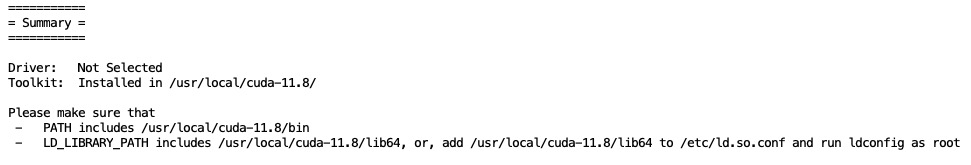

# 命令

## find
find /home/WujieAITeam/private -type d -name "stable-diffusion-xl-base-1.0"

find /home/WujieAITeam/private -name "mjhq30k_imgs.zip"

   

## tmux
tmux kill-session -t edm2  
tmux attach -t edm2   
tmux new-session -s edm2   

## kill 显存
通过以下命令查看僵尸进程    
sudo fuser -v /dev/nvidia*  
找到COMMAND=python的，然后通过以下命令逐一kill僵尸进程    
sudo kill -9 进程q

进程查看 ps -ef

## 镜像hug下载

export HF_ENDPOINT=https://hf-mirror.com

huggingface-cli download --repo-type dataset --resume-download playgroundai/MJHQ-30K --local-dir playgroundai/MJHQ-30K

huggingface-cli download --resume-download gpt2 --local-dir gpt2

### 单文件
wget https://hf-mirror.com/runwayml/stable-diffusion-v1-5/resolve/main/v1-5-pruned-emaonly.safetensors?download=true

这样一般下载得，需要重命名 'yoso_lora.safetensors?download=true'

而不是  
wget https://hf-mirror.com/runwayml/stable-diffusion-v1-5/blob/main/v1-5-pruned-emaonly.safetensors

## 删除设置的环境变量

unset HF_ENDPOINT   
echo $HF_ENDPOINT    

## Linux统计文件夹下的文件数目
统计当前目录下文件的个数（不包括目录）  
ls -l | grep "^-" | wc -l   
统计当前目录下文件的个数（包括子目录）   
ls -lR| grep "^-" | wc -l   
查看某目录下文件夹(目录)的个数（包括子目录）  
ls -lR | grep "^d" | wc -l   

ls -l   
长列表输出该目录下文件信息(注意这里的文件是指目录、链接、设备文件等)，每一行对应一个文件或目录，ls -lR是列出所有文件，包括子目录。

grep "^-"   
过滤ls的输出信息，只保留一般文件，只保留目录是grep "^d"。

wc -l   
统计输出信息的行数，统计结果就是输出信息的行数，一行信息对应一个文件，所以就是文件的个数。

## 端口转发
此外，如果我们开发的是 WEB 应用，为了能够浏览到远程主机上的应用，我们可以利用另一个端口转发的功能来实现。

## 远程服务器vscode debug
必须先在服务器上装python和python debugger扩展   
没有就是vscode版本太久，某些方面不兼容了    

## diffusers转ckpt safetensors
python scripts/convert_diffusers_to_original_stable_diffusion.py --model_path model_dir --checkpoint_path path_to_ckpt.ckpt

## github镜像
github在国内会碰到下载不稳定的情况，推荐使用镜像

https://bgithub.xyz/
将前缀更换即可，例如：

https://github.com/OpenGVLab/CaFo
https://bgithub.xyz/OpenGVLab/CaFo

## conda复制环境和删除环境

conda create --name <new_environment_name> --clone <existing_environment_name>

conda remove --name <environment_name> --all

## 终端上网
export http_proxy=127.0.0.1:7890
export https_proxy=127.0.0.1:7890

export http_proxy="http://127.0.0.1:7890"
export https_proxy="http://127.0.0.1:7890"

unset http_proxy
unset https_proxy

## 终端查找历史命令

使用 Ctrl + R 进行反向搜索：
您可以按下 Ctrl + R 键，然后开始输入部分命令。终端会自动显示最接近的匹配项。继续按 Ctrl + R 将继续在历史记录中搜索更早的命令。

## torch将变量从cpu转到cuda，相同浮点数
noise = noise.to('cuda')

mat1 and mat2 must have the same dtype
tensor = torch.randn(3, 3)
tensor_float16 = tensor.to(torch.float16)

## vim退出保存
:wq   
:q   
:q!   

vim删除所有   
esc.不要进入：     
使用 ggdG 命令。这个命令的含义是：   
gg 将光标移动到文件的开头。   
dG 删除从当前光标位置到文件末尾的所有内容。   

## pip中科大源
pip install torch -i https://pypi.mirrors.ustc.edu.cn/simple/    

## 查看机器型号下载cuda
uname -m   
arch   
lsb_release -a   

## 软连接

ln -s <target> <link_name>

hug上下载的权重有软连接，直接mv很多移动不了   

# 报错

## 新机器装环境
### 装cuda toolkit 11.8   
直接runfile两行    
   
   
wget https://developer.download.nvidia.com/compute/cuda/11.8.0/local_installers/cuda_11.8.0_520.61.05_linux.run   
sudo sh cuda_11.8.0_520.61.05_linux.run   

### webui    
采取直接安装在conda的方法    
No module 'xformers'. Proceeding without it.    
明明环境装了最新的xformers    
能运行但没有xformers    
https://github.com/AUTOMATIC1111/stable-diffusion-webui/wiki/Install-and-Run-on-NVidia-GPUs   

python launch.py --xformers

以下使用venvs安装失败    

RROR: Cannot activate python venv, aborting...   

E: Unable to locate package python3.10-venv   
sudo apt-get update    
sudo apt-get upgrade      

apt install python3.10-venv   
E: Unable to locate package python3.10-venv   
E: Couldn't find any package by glob 'python3.10-venv'   

sudo apt install  python3-venv     

./webui.sh   
ERROR: Cannot activate python venv, aborting...   

python3 -m venv venv    
Error: [Errno 38] Function not implemented: 'lib' -> '/teams/ai_model_1667305326/WujieAITeam/private/lujunda/stable-diffusion-webui/venv/lib64'    

失败路线，可能是linux系统版本问题???

    No LSB modules are available.
    Distributor ID: Ubuntu
    Description:    Ubuntu 20.04.6 LTS
    Release:        20.04
    Codename:       focal

    Linux q1yOYo 4.19.0-14-amd64 #1 SMP Debian 4.19.171-2 (2021-01-30) x86_64 x86_64 x86_64 GNU/Linux

最新webui不适配python3.8       

前面加装cuda11.8以及装cudnn,最后一步其实报错    
通过装python3.10, torch2.1.2，运行launch.py    
安装成功  

### 装git lfs
curl -s https://packagecloud.io/install/repositories/github/git-lfs/script.deb.sh | sudo bash    
sudo apt-get install git-lfs     

## 常见cudnn报错
python: symbol lookup error: /root/miniconda3/envs/webui310/lib/python3.10/site-packages/torch/lib/../../nvidia/cudnn/lib/libcudnn_cnn_infer.so.8: undefined symbol: _ZN15TracebackLoggerC1EPKc, version libcudnn_ops_infer.so.8    

原始  
export LD_LIBRARY_PATH=$LD_LIBRARY_PATH:/usr/local/nvidia/lib:/usr/local/nvidia/lib64:/usr/local/cuda/lib64/:/usr/lib/x86_64-linux-gnu
export PATH=$PATH:/usr/local/cuda/bin:/usr/bin:/usr/sbin

改成   
普通模式，没啥用   
export LD_LIBRARY_PATH=$LD_LIBRARY_PATH:/usr/local/cuda/lib64   
export PATH=$PATH:/usr/local/cuda/bin

source ~/.bashrc

可能原因是先装了最新torch cu118在cuda11.3,后面才去换成cuda11.8   
没用   

终端  
export LD_LIBRARY_PATH=$LD_LIBRARY_PATH:/root/miniconda3/envs/web310new/lib/python3.10/site-packages/
nvidia/cudnn/lib    
没用   

sudo apt-get -y install cudnn-cuda-11

    Reading package lists... Done
    Building dependency tree       
    Reading state information... Done
    Note, selecting 'cudnn9-cuda-11' instead of 'cudnn-cuda-11'
    Some packages could not be installed. This may mean that you have
    requested an impossible situation or if you are using the unstable
    distribution that some required packages have not yet been created
    or been moved out of Incoming.
    The following information may help to resolve the situation:

    The following packages have unmet dependencies:
    cudnn9-cuda-11 : Depends: cudnn9-cuda-11-8 (>= 9.0.0.312) but it is not going to be installed
    E: Unable to correct problems, you have held broken packages.
想重装cudnn一直报错    

## 安装xformers报错
ERROR: Could not build wheels for xformers, which is required to install pyproject.toml-based projects    
这个问题是由于cuda版本、nvcc版本、Pytorch版本不一致所导致的。    

## safetensor header too large
加载lora失败
Name: safetensors
Version: 0.4.2
Name: diffusers
Version: 0.28.0.dev0

换机器加载成功
都是a800
但是担心比较时显存和速度会有所不同
Name: safetensors
Version: 0.4.2
Name: diffusers
Version: 0.25.0

旧机器报错

    Traceback (most recent call last):
    File "/root/miniconda3/envs/emd-new/lib/python3.8/site-packages/diffusers/models/modeling_utils.py", line 109, in load_state_dict
    return safetensors.torch.load_file(checkpoint_file, device="cpu")
    File "/root/miniconda3/envs/emd-new/lib/python3.8/site-packages/safetensors/torch.py", line 308, in load_file
    with safe_open(filename, framework="pt", device=device) as f:
    safetensors_rust.SafetensorError: Error while deserializing header: HeaderTooLarge

    During handling of the above exception, another exception occurred:

    Traceback (most recent call last):
    File "/root/miniconda3/envs/emd-new/lib/python3.8/site-packages/diffusers/models/modeling_utils.py", line 120, in load_state_dict
    if f.read().startswith("version"):
    File "/root/miniconda3/envs/emd-new/lib/python3.8/codecs.py", line 322, in decode
    (result, consumed) = self._buffer_decode(data, self.errors, final)
    UnicodeDecodeError: 'utf-8' codec can't decode byte 0x80 in position 64: invalid start byte

    During handling of the above exception, another exception occurred:

    Traceback (most recent call last):
    File "/lujunda/diffusers-main/examples/inference/yoso-infer-1step.py", line 23, in
    pipeline.load_lora_weights('/lujunda/diffusers-main/examples/inference/yoso_lora.safetensors')
    File "/root/miniconda3/envs/emd-new/lib/python3.8/site-packages/diffusers/loaders/lora.py", line 114, in load_lora_weights
    state_dict, network_alphas = self.lora_state_dict(pretrained_model_name_or_path_or_dict, **kwargs)
    File "/root/miniconda3/envs/emd-new/lib/python3.8/site-packages/huggingface_hub/utils/_validators.py", line 119, in _inner_fn
    return fn(*args, **kwargs)
    File "/root/miniconda3/envs/emd-new/lib/python3.8/site-packages/diffusers/loaders/lora.py", line 284, in lora_state_dict
    state_dict = load_state_dict(model_file)
    File "/root/miniconda3/envs/emd-new/lib/python3.8/site-packages/diffusers/models/modeling_utils.py", line 132, in load_state_dict
    raise OSError(
    OSError: Unable to load weights from checkpoint file for '/lujunda/diffusers-main/examples/inference/yoso_lora.safetensors' at '/lujunda/diffusers-main/examples/inference/yoso_lora.safetensors'.

## conda装环境报错

conda装torch等报错   
改国内镜像也没用   
改之后倒是还可以装python   

原始

    channel_alias: https://mirrors.tuna.tsinghua.edu.cn/anaconda
    channels:
    - defaults
    custom_channels:
    conda-forge: https://mirrors.tuna.tsinghua.edu.cn/anaconda/cloud
    msys2: https://mirrors.tuna.tsinghua.edu.cn/anaconda/cloud
    bioconda: https://mirrors.tuna.tsinghua.edu.cn/anaconda/cloud
    menpo: https://mirrors.tuna.tsinghua.edu.cn/anaconda/cloud
    pytorch: https://mirrors.tuna.tsinghua.edu.cn/anaconda/cloud
    simpleitk: https://mirrors.tuna.tsinghua.edu.cn/anaconda/cloud
    default_channels:
    - https://mirrors.tuna.tsinghua.edu.cn/anaconda/pkgs/main
    - https://mirrors.tuna.tsinghua.edu.cn/anaconda/pkgs/r
    show_channel_urls: True

改成

    channel_alias: https://anaconda.mirrors.sjtug.sjtu.edu.cn
    channels:
    - defaults
    custom_channels:
    conda-forge: https://anaconda.mirrors.sjtug.sjtu.edu.cn/cloud
    msys2: https://anaconda.mirrors.sjtug.sjtu.edu.cn/cloud
    bioconda: https://anaconda.mirrors.sjtug.sjtu.edu.cn/cloud
    menpo: https://anaconda.mirrors.sjtug.sjtu.edu.cn/cloud
    pytorch: https://anaconda.mirrors.sjtug.sjtu.edu.cn/cloud
    simpleitk: https://anaconda.mirrors.sjtug.sjtu.edu.cn/cloud
    default_channels:
    - https://anaconda.mirrors.sjtug.sjtu.edu.cn/pkgs/main
    - https://anaconda.mirrors.sjtug.sjtu.edu.cn/pkgs/r
    show_channel_urls: Tr

# 结尾

