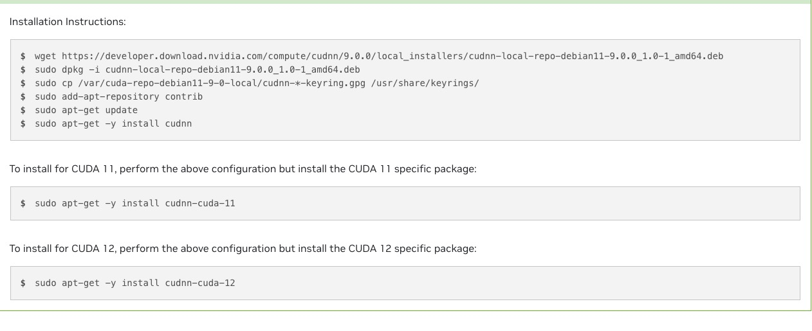

# 程序、环境 报错

## 新机器装环境
### 装cuda toolkit 11.8   
直接runfile两行    
   
   
wget https://developer.download.nvidia.com/compute/cuda/11.8.0/local_installers/cuda_11.8.0_520.61.05_linux.run   
sudo sh cuda_11.8.0_520.61.05_linux.run   

### webui    
采取直接安装在conda的方法    
No module 'xformers'. Proceeding without it.    
明明环境装了最新的xformers    
能运行但没有xformers    
https://github.com/AUTOMATIC1111/stable-diffusion-webui/wiki/Install-and-Run-on-NVidia-GPUs   

python launch.py --xformers

以下使用venvs安装失败    

RROR: Cannot activate python venv, aborting...   

E: Unable to locate package python3.10-venv   
sudo apt-get update    
sudo apt-get upgrade      

apt install python3.10-venv   
E: Unable to locate package python3.10-venv   
E: Couldn't find any package by glob 'python3.10-venv'   

sudo apt install  python3-venv     

./webui.sh   
ERROR: Cannot activate python venv, aborting...   

python3 -m venv venv    
Error: [Errno 38] Function not implemented: 'lib' -> '/teams/ai_model_1667305326/WujieAITeam/private/lujunda/stable-diffusion-webui/venv/lib64'    

失败路线，可能是linux系统版本问题???

    No LSB modules are available.
    Distributor ID: Ubuntu
    Description:    Ubuntu 20.04.6 LTS
    Release:        20.04
    Codename:       focal

    Linux q1yOYo 4.19.0-14-amd64 #1 SMP Debian 4.19.171-2 (2021-01-30) x86_64 x86_64 x86_64 GNU/Linux

最新webui不适配python3.8        
    

3090 前面加装cuda11.8以及,装cudnn最后一步其实报错    
一直没有运行成功   
   
    
The following packages have unmet dependencies: cudnn9-cuda-11 : Depends: cudnn9-cuda-11-8 (>= 9.0.0.312) but it is not going to be installed E: Unable to correct problems, you have held broken packages.

#### 旧a800
通过装python3.10, torch2.1.2，运行launch.py    
安装成功  
在旧A100上试，cuda11.7
具体不知道哪一步起到关键作用   
没装xformers  
试一下    
装不了   
ERROR: Failed building wheel for xformers
  Running setup.py clean for xformers
  Running command python setup.py clean
  running clean
  'build/lib.linux-x86_64-cpython-310' does not exist -- can't clean it
  'build/bdist.linux-x86_64' does not exist -- can't clean it
  'build/scripts-3.10' does not exist -- can't clean it
Failed to build xformers
ERROR: Could not build wheels for xformers, which is required to install pyproject.toml-based projects    

pip install pyproject    
仍然是这个错误    

WARNING: Running pip as the 'root' user can result in broken permissions and conflicting behaviour with the system package manager. It is recommended to use a virtual environment instead: https://pip.pypa.io/warnings/venv    

可能因为是root   

https://github.com/AUTOMATIC1111/stable-diffusion-webui/wiki/Xformers#building-xformers-on-linux-from-anonymous-user   

#### 3090
在3090重试重装   
除了cuda11.8和cudnn有点问题    
pip install torch==2.1.2 torchvision==0.16.2 torchaudio==2.1.2 --index-url https://download.pytorch.org/whl/cu118      
还有一个是没用镜像下载torch   
stable-diffusion-webui-master，不是web.sh下载的    
竟然可以    
    
    
12it/s     
1 girl    
Steps: 20, Sampler: DPM++ 2M SDE Karras, CFG scale: 7, Seed: 1039081822, Size: 512x512, Model hash: 6ce0161689, Model: v1-5-pruned-emaonly, Version: 1.8.0-RC

Time taken: 2.0 sec.

A: 3.11 GB, R: 3.58 GB, Sys: 4.5/23.6914 GB (18.9%)   
Model loaded in 50.8s (load weights from disk: 2.2s, create model: 0.5s, apply weights to model: 47.8s, calculate empty prompt: 0.1s).     
3.5g    
v1-5-pruned-emaonly.safetensors       

## pyproject.toml-based
### opencv
ERROR: Could not build wheels for opencv-python, which is required to install pyproject.toml-based projects

尝试安装早期版本的 OpenCV，就像在我的例子中，以下版本有效。 pip install opencv-python==4.5.3.56 

这个不像4.4.0.40需要build wheel

### xformers
ERROR: Could not build wheels for xformers, which is required to install pyproject.toml-based projects    
这个问题是由于cuda版本、nvcc版本、Pytorch版本不一致所导致的。    
也可能是root安装的问题    
可能必须采用venv  

### mpi4py

    collect2: error: ld returned 1 exit status
        failure.
        removing: _configtest.c _configtest.o
        error: Cannot link MPI programs. Check your configuration!!!
        [end of output]
    
    note: This error originates from a subprocess, and is likely not a problem with pip.
    ERROR: Failed building wheel for mpi4py
    Failed to build mpi4py
    ERROR: Could not build wheels for mpi4py, which is required to install pyproject.toml-based projects

解决方法:     
换conda安装     
conda install mpi4py  

## Segmentation fault (core dumped)   
新版本适配的CUDA和torch就可以了

### 第一个错误

    File "/root/miniconda3/envs/iclight/lib/python3.10/site-packages/torch/cuda/__init__.py", line 293, in _lazy_init
        torch._C._cuda_init()
    RuntimeError: The NVIDIA driver on your system is too old (found version 11040). Please update your GPU driver by downloading and installing a new version from the URL: http://www.nvidia.com/Download/index.aspx Alternatively, go to: https://pytorch.org to install a PyTorch version that has been compiled with your version of the CUDA driver.

pip install torch torchvision --index-url https://download.pytorch.org/whl/cu121    

torch                     2.3.0+cu121        
torchvision               0.18.0+cu121

不匹配        
nvcc 11.8         
nvidia-smi CUDA 11.4        

pip install torch==2.2.2 torchvision==0.17.2 torchaudio==2.2.2 --index-url https://download.pytorch.org/whl/cu118

降低torch版本可以了

### 第二次错误
推理时候。    
Segmentation fault (core dumped)     
应该是c++ c层面的错误，空指针，堆栈溢出,tensor问题等      

以前在jetson上使用c++程序也遇到过    

换机器重装

Nvidia-smi CUDA Version: 12.2     
Nvcc 11.8   
pip install torch torchvision --index-url https://download.pytorch.org/whl/cu121     
可以了   

### 第二次出现：使用forge时又出现一次
forge自动装环境

推理出现 Segmentation fault (core dumped)

并且这个平台不会返回具体错误信息     

卡在反向推理。中断

    torch                     2.2.2+cu118
    torchaudio                2.2.2+cu118
    torchdiffeq               0.2.3
    torchmetrics              1.4.0
    torchsde                  0.2.6
    torchvision               0.17.2+cu118

pip install torch torchvision --index-url https://download.pytorch.org/whl/cu121     

open-clip-torch 2.20.0 requires protobuf<4, but you have protobuf 4.25.3 which is incompatible.

ile "/teams/ai_model_1667305326/WujieAITeam/private/lujunda/newlytest/stable-diffusion-webui-forge/modules/launch_utils.py", line 431, in prepare_environment
    raise RuntimeError(
RuntimeError: Torch is not able to use GPU; add --skip-torch-cuda-test to COMMANDLINE_ARGS variable to disable this check

pip install -U open-clip-torch

Successfully installed open-clip-torch-2.24.0

还是启动不了launch 

    File "/teams/ai_model_1667305326/WujieAITeam/private/lujunda/newlytest/stable-diffusion-webui-forge/launch.py", line 39, in main
        prepare_environment()
    File "/teams/ai_model_1667305326/WujieAITeam/private/lujunda/newlytest/stable-diffusion-webui-forge/modules/launch_utils.py", line 431, in prepare_environment
        raise RuntimeError(
    RuntimeError: Torch is not able to use GPU; add --skip-torch-cuda-test to COMMANDLINE_ARGS variable to disable this check

File "/root/miniconda3/envs/iclight/lib/python3.10/site-packages/torch/cuda/__init__.py", line 293, in _lazy_init
    torch._C._cuda_init()
RuntimeError: The NVIDIA driver on your system is too old (found version 11040). Please update your GPU driver by downloading and installing a new version from the URL: http://www.nvidia.com/Download/index.aspx Alternatively, go to: https://pytorch.org to install a PyTorch version that has been compiled with your version of the CUDA driver.

nvcc 11.8     
CUDA Version: 11.4    

我给忘记2机是个问题机了            

始终是机子和CUDA和torch的傻逼问题

## 常见cudnn报错

### undefined symbol: _ZN15TracebackLoggerC1EPKc, version libcudnn_ops_infer.so.8  
python: symbol lookup error: /root/miniconda3/envs/webui310/lib/python3.10/site-packages/torch/lib/../../nvidia/cudnn/lib/libcudnn_cnn_infer.so.8: undefined symbol: _ZN15TracebackLoggerC1EPKc, version libcudnn_ops_infer.so.8    

搭建 resemble-enhance 这个项目的过程中，在 Ubuntu20.04的机器上跑，报错如下：

undefined symbol: _ZN15TracebackLoggerC1EPKc, version libcudnn_ops_infer.so.8
1

    这个错误是在 NVIDIA GPU 上使用 PyTorch 2.1.2 和 cuDNN 12.1 时使用 torch.nn.Conv2d 时出现符号查找错误，这意味着 PyTorch 正在尝试在库 libcudnn_ops_infer.so.8 中查找名为 _ZN15TracebackLoggerC1EPKc 的符号，但该符号不存在， 发生这种情况的原因有多种，包括：
    1、cuDNN 版本之间不匹配：虽然安装了 cuDNN 12.1，但用于构建 PyTorch (cu121) 的 cuDNN 版本与系统上可用的 cuDNN 版本之间可能不匹配
    2、库路径不正确，环境中 cuDNN 库的路径可能不正确
    3、cuDNN 安装损坏或不完整，cuDNN 安装可能已损坏或不完整

原始  
export LD_LIBRARY_PATH=$LD_LIBRARY_PATH:/usr/local/nvidia/lib:/usr/local/nvidia/lib64:/usr/local/cuda/lib64/:/usr/lib/x86_64-linux-gnu
export PATH=$PATH:/usr/local/cuda/bin:/usr/bin:/usr/sbin

改成   
普通模式，没啥用   
export LD_LIBRARY_PATH=$LD_LIBRARY_PATH:/usr/local/cuda/lib64   
export PATH=$PATH:/usr/local/cuda/bin

source ~/.bashrc

可能原因是先装了最新torch cu118在cuda11.3,后面才去换成cuda11.8   
没用   

终端  
export LD_LIBRARY_PATH=$LD_LIBRARY_PATH:/root/miniconda3/envs/web310new/lib/python3.10/site-packages/
nvidia/cudnn/lib    
没用   

sudo apt-get -y install cudnn-cuda-11

    Reading package lists... Done
    Building dependency tree       
    Reading state information... Done
    Note, selecting 'cudnn9-cuda-11' instead of 'cudnn-cuda-11'
    Some packages could not be installed. This may mean that you have
    requested an impossible situation or if you are using the unstable
    distribution that some required packages have not yet been created
    or been moved out of Incoming.
    The following information may help to resolve the situation:

    The following packages have unmet dependencies:
    cudnn9-cuda-11 : Depends: cudnn9-cuda-11-8 (>= 9.0.0.312) but it is not going to be installed
    E: Unable to correct problems, you have held broken packages.
想重装cudnn一直报错    

尝试装符合的pytorch nvcc      
成功解决   

## CUDNN_STATUS_INTERNAL_ERROR

nvcc11.8,torch 2.0.0没说明cu版本   
好像默认11.7   

    File "/root/miniconda3/envs/pixart/lib/python3.9/site-packages/torch/nn/modules/conv.py", line 459, in _conv_forward
        return F.conv2d(input, weight, bias, self.stride,
    RuntimeError: cuDNN error: CUDNN_STATUS_INTERNAL_ERROR

pip install torch==2.0.0 torchvision==0.15.1 torchaudio==2.0.1 --index-url https://download.pytorch.org/whl/cu118      
卸载重装     
还是cudnn错误   

但是这个3090是可以运行webui推理    

有人说 其实就是gpu显存不够，减小点工作量就可以了    

2、手动使用cudnn

    import torch
    torch.backends.cudnn.enabled = False

## unable to find an engine to execute this computation
RuntimeError: GET was unable to find an engine to execute this computation

显存不够  tile过大      

    File "/root/miniconda3/envs/comfy/lib/python3.11/site-packages/torch/nn/modules/conv.py", line 460, in forward
        return self._conv_forward(input, self.weight, self.bias)
            ^^^^^^^^^^^^^^^^^^^^^^^^^^^^^^^^^^^^^^^^^^^^^^^^^
    File "/root/miniconda3/envs/comfy/lib/python3.11/site-packages/torch/nn/modules/conv.py", line 456, in _conv_forward
        return F.conv2d(input, weight, bias, self.stride,
            ^^^^^^^^^^^^^^^^^^^^^^^^^^^^^^^^^^^^^^^^^^
    RuntimeError: GET was unable to find an engine to execute this computation
并不是torch和nvcc版本的问题     

   

## safetensor header too large
加载lora失败
Name: safetensors
Version: 0.4.2
Name: diffusers
Version: 0.28.0.dev0

换机器加载成功
都是a800
但是担心比较时显存和速度会有所不同
Name: safetensors
Version: 0.4.2
Name: diffusers
Version: 0.25.0

旧机器报错

    Traceback (most recent call last):
    File "/root/miniconda3/envs/emd-new/lib/python3.8/site-packages/diffusers/models/modeling_utils.py", line 109, in load_state_dict
    return safetensors.torch.load_file(checkpoint_file, device="cpu")
    File "/root/miniconda3/envs/emd-new/lib/python3.8/site-packages/safetensors/torch.py", line 308, in load_file
    with safe_open(filename, framework="pt", device=device) as f:
    safetensors_rust.SafetensorError: Error while deserializing header: HeaderTooLarge

    During handling of the above exception, another exception occurred:

    Traceback (most recent call last):
    File "/root/miniconda3/envs/emd-new/lib/python3.8/site-packages/diffusers/models/modeling_utils.py", line 120, in load_state_dict
    if f.read().startswith("version"):
    File "/root/miniconda3/envs/emd-new/lib/python3.8/codecs.py", line 322, in decode
    (result, consumed) = self._buffer_decode(data, self.errors, final)
    UnicodeDecodeError: 'utf-8' codec can't decode byte 0x80 in position 64: invalid start byte

    During handling of the above exception, another exception occurred:

    Traceback (most recent call last):
    File "/lujunda/diffusers-main/examples/inference/yoso-infer-1step.py", line 23, in
    pipeline.load_lora_weights('/lujunda/diffusers-main/examples/inference/yoso_lora.safetensors')
    File "/root/miniconda3/envs/emd-new/lib/python3.8/site-packages/diffusers/loaders/lora.py", line 114, in load_lora_weights
    state_dict, network_alphas = self.lora_state_dict(pretrained_model_name_or_path_or_dict, **kwargs)
    File "/root/miniconda3/envs/emd-new/lib/python3.8/site-packages/huggingface_hub/utils/_validators.py", line 119, in _inner_fn
    return fn(*args, **kwargs)
    File "/root/miniconda3/envs/emd-new/lib/python3.8/site-packages/diffusers/loaders/lora.py", line 284, in lora_state_dict
    state_dict = load_state_dict(model_file)
    File "/root/miniconda3/envs/emd-new/lib/python3.8/site-packages/diffusers/models/modeling_utils.py", line 132, in load_state_dict
    raise OSError(
    OSError: Unable to load weights from checkpoint file for '/lujunda/diffusers-main/examples/inference/yoso_lora.safetensors' at '/lujunda/diffusers-main/examples/inference/yoso_lora.safetensors'.

## conda装环境报错

conda装torch等报错   
改国内镜像也没用   
改之后倒是还可以装python   

原始

    channel_alias: https://mirrors.tuna.tsinghua.edu.cn/anaconda
    channels:
    - defaults
    custom_channels:
    conda-forge: https://mirrors.tuna.tsinghua.edu.cn/anaconda/cloud
    msys2: https://mirrors.tuna.tsinghua.edu.cn/anaconda/cloud
    bioconda: https://mirrors.tuna.tsinghua.edu.cn/anaconda/cloud
    menpo: https://mirrors.tuna.tsinghua.edu.cn/anaconda/cloud
    pytorch: https://mirrors.tuna.tsinghua.edu.cn/anaconda/cloud
    simpleitk: https://mirrors.tuna.tsinghua.edu.cn/anaconda/cloud
    default_channels:
    - https://mirrors.tuna.tsinghua.edu.cn/anaconda/pkgs/main
    - https://mirrors.tuna.tsinghua.edu.cn/anaconda/pkgs/r
    show_channel_urls: True

改成

    channel_alias: https://anaconda.mirrors.sjtug.sjtu.edu.cn
    channels:
    - defaults
    custom_channels:
    conda-forge: https://anaconda.mirrors.sjtug.sjtu.edu.cn/cloud
    msys2: https://anaconda.mirrors.sjtug.sjtu.edu.cn/cloud
    bioconda: https://anaconda.mirrors.sjtug.sjtu.edu.cn/cloud
    menpo: https://anaconda.mirrors.sjtug.sjtu.edu.cn/cloud
    pytorch: https://anaconda.mirrors.sjtug.sjtu.edu.cn/cloud
    simpleitk: https://anaconda.mirrors.sjtug.sjtu.edu.cn/cloud
    default_channels:
    - https://anaconda.mirrors.sjtug.sjtu.edu.cn/pkgs/main
    - https://anaconda.mirrors.sjtug.sjtu.edu.cn/pkgs/r
    show_channel_urls: Tr

## forge
### No module named 'tqdm.auto'
安装插件后出现。再次启动启动不了

操作：

1、他在extension文件夹中，新安装了一个TemporalKit插件，结果就这样了。

2、他又将新安装的TemporalKit文件夹删除，还是不行，还是报上面那个错误。

原因：

如果你的sd版本是最新的话，只要用了TemporalKit就会一直报错，这是因为最新的sd版本会出现和TemporalKit版本不兼容的问题，把sd版本降一下就好了。

    Attempting uninstall: tqdm
        Found existing installation: tqdm 4.11.2
        Uninstalling tqdm-4.11.2:
        Successfully uninstalled tqdm-4.11.2
    ERROR: pip's dependency resolver does not currently take into account all the packages that are installed. This behaviour is the source of the following dependency conflicts.
    moviepy 0.2.3.2 requires tqdm==4.11.2, but you have tqdm 4.66.4 which is incompatible.
    Successfully installed tqdm-4.66.4

启动成功   

## debug webui
### CUDA Setup failed despite GPU being available. Please run the following command to get more information

    _functions.py 10 <module>
    import bitsandbytes.functional as F

    functional.py 17 <module>
    from .cextension import COMPILED_WITH_CUDA, lib

    cextension.py 17 <module>
    raise RuntimeError('''

    RuntimeError:

            CUDA Setup failed despite GPU being available. Please run the following command to get more information:

            python -m bitsandbytes

            Inspect the output of the command and see if you can locate CUDA libraries. You might need to add them
            to your LD_LIBRARY_PATH. If you suspect a bug, please take the information from python -m bitsandbytes
            and open an issue at: https://github.com/TimDettmers/bitsandbytes/issues

3机启动webui 会 爆这个错      
但是正常运行   

## python
### UnboundLocalError: local variable ‘a‘ referenced before assignment
在if中assignment，在外部return    
python版本问题，3.10不会    

# git 报错
## 无法pull repo
* branch            main       -> FETCH_HEAD
error: invalid path '415419/assets/PixArt-ControlNet /image-1.png'

md命名结尾有空格，自创建图片文件夹名字结尾有空格，虽然能push上去，但是pull时候git会检查，这时候就过不了    

## 无法pull repo2
既有push的改变，又有pull的改变    
需要先拉下来pull本地合并再push推上去   

# 电脑键盘忽然整体失灵
笔记本 以及外接都失灵，只有两岸调节能用       
todesk远控机在后台使用的原因

# for : 'tuple' object is not callable
    prompt_list = [
        (1024, 1024, "incredibly absurdres,there is a woman sitting at a table with a book,female actress from korea,popular south korean makeup,popular korean makeup,gongbi,portrait of female korean idol")
        (928, 1248, "Banquet evening dress for a beautiful Asian woman, diamond sequins and feather embellishment, chic style, elegant white, ferrous iron p30, high quality, eye-catching, elegant formal, matte photo, elegant, pair of huge black Feathered wings, delicate features, long eyelashes, studio light, cool expression")
        (832, 1472, "Contemporary Ballet Inspiration: A graceful, ethereal studio image of a girl in a tulle skirt and leotard, emulating the poise of a ballerina, her makeup soft and elegant, incorporating shades of pink blush and shimmering highlighter to enhance her natural beauty.")
        (832, 1472, "a woman in a white dress posing in front of a window")
    ]

for (width, height, prompt) in prompt_list:

    TypeError                                 Traceback (most recent call last)
    Cell In[2], line 51
        47 decorated_prompt = text_prompt + prompt
        48 decorated_negative_prompt = uc + negative_prompt
        50 prompt_list = [
    ---> 51     (1024, 1024, "incredibly absurdres,there is a woman sitting at a table with a book,female actress from korea,popular south korean makeup,popular korean makeup,gongbi,portrait of female korean idol")
        52     (928, 1248, "Banquet evening dress for a beautiful Asian woman, diamond sequins and feather embellishment, chic style, elegant white, ferrous iron p30, high quality, eye-catching, elegant formal, matte photo, elegant, pair of huge black Feathered wings, delicate features, long eyelashes, studio light, cool expression")
        53     (832, 1472, "Contemporary Ballet Inspiration: A graceful, ethereal studio image of a girl in a tulle skirt and leotard, emulating the poise of a ballerina, her makeup soft and elegant, incorporating shades of pink blush and shimmering highlighter to enhance her natural beauty.")
        54     (832, 1472, "a woman in a white dress posing in front of a window")
        55 ]
        56 i = 0
        57 for step in steps:

    TypeError: 'tuple' object is not callable

换了一下

    prompt_list = [
        [1024, 1024, "incredibly absurdres,there is a woman sitting at a table with a book,female actress from korea,popular south korean makeup,popular korean makeup,gongbi,portrait of female korean idol"]
        [928, 1248, "Banquet evening dress for a beautiful Asian woman, diamond sequins and feather embellishment, chic style, elegant white, ferrous iron p30, high quality, eye-catching, elegant formal, matte photo, elegant, pair of huge black Feathered wings, delicate features, long eyelashes, studio light, cool expression"]
        [832, 1472, "Contemporary Ballet Inspiration: A graceful, ethereal studio image of a girl in a tulle skirt and leotard, emulating the poise of a ballerina, her makeup soft and elegant, incorporating shades of pink blush and shimmering highlighter to enhance her natural beauty."]
        [832, 1472, "a woman in a white dress posing in front of a window"]
    ]
TypeError: list indices must be integers or slices, not tuple    
是的，您有一个小错误。在每个列表项之间，您需要添加逗号。这样的话，Python 才能正确地将其解析为一个列表。这是您的修正版本：   

终于可以    

for (width, height, prompt) in prompt_list:    
仍然是这样读取

# 结尾