# 失败记录
shopee  cv  好像是24春招 或社招        

7.13目前回应的都是小公司 而且是实习 小公司一般都是春招

# 恶心公司
京东实习 上来先一个星期的测评

腾讯更恶心

唯此两家

优酷boss社招 相关工作 直接不给过 就三万

百度好像实习生没机会了 之前四次失败记录     
校招好像有问题 投不了

# 投不了的 腾讯 百度

# 7.5报名 网易伏羲 雷火 挂
 笔试一个月后 网易伏羲 雷火 aigc       

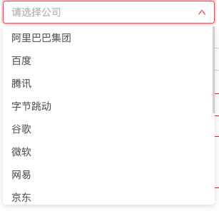

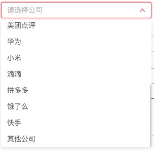

820据说hc少 而且裁员裁到大动脉       
反正是没有通知 直接不处理 不管 傻逼玩意儿

# 7.10
## shopee  cv  
失败

https://app.mokahr.com/campus_apply/shopee/2962#/job/a5cbf048-8c6f-4192-9cb1-1eb4fbbf1e2c/campus_apply/thanks?jobId=a5cbf048-8c6f-4192-9cb1-1eb4fbbf1e2c&applyInfo%5BaimWorkCity%5D=%E6%B7%B1%E5%9C%B3%E5%B8%82&candidateName=&candidateId=545933402

%E9%99%86%E4%BF%8A%E8%BE%BE

https://app.mokahr.com/campus_apply/shopee/2962#/jobs

## 深信服 ai领跑 818一道也写不出

https://app.mokahr.com/campus_apply/sangfor/27944#/job/43d7cc55-426e-4211-8199-95cecb2a3fca/campus_apply/thanks?jobId=43d7cc55-426e-4211-8199-95cecb2a3fca&applyInfo%5BcampusSiteId%5D=714&applyInfo%5BaimWorkCity%5D=%E6%B7%B1%E5%9C%B3%E5%B8%82&candidateName=&candidateId=545947717&pure=1

%E9%99%86%E4%BF%8A%E8%BE%BE
## 360 无效 无效 720 803 预估下次817 已经失效没有再匹配得岗位
https://360campus.zhiye.com/campus/detail?jobAdId=23d04b49-d12c-4d3f-9564-f78ccc3cea13

视觉校招

开始时间： 2024-07-20 15:00 星期六（为保证作答时间请在18:00前登陆）笔试时长： 120 分钟结束时间： 2024-07-20 20:00 星期六 

360公司】2025校招提前批在线考试 不写

未确认 也不写
803.15-20

AIGC算法实习生（北京）

    AI大模型算法实习生-4170(J10919)
    实习生招聘
    实习
    北京市
    2024-06-24发布
    工作职责
    参与公司基础大模型360智脑的训练工作
    任职资格
    1. 计算机相关专业硕士及以上学历。NLP和深度学习理论基础扎实，有实际的项目落地经验
    2. 掌握transformer，阅读过transformer源码，对bert/gpt有较好理解
    3. 编程功底扎实，掌握python编程，熟悉pytorch/tensorflow至少一种深度学习框架
    4. 每周到岗至少4天，实习期不低于4个月
    5. 博士优先，发表过顶会论文优先

## oppo 无效 727 810 预估下次823 失效没有重来再投机会
图文创作

https://careers.oppo.com/university/oppo/campus/post/1205

727笔试没写 测评没写

## 710实习

### 京东实习 没什么后续消息 卡住
视觉

https://campus.jd.com/#/deliverSuccess

### 高德

https://talent.amap.com/campus/position-detail?lang=zh&positionId=39900001008

aigc生成

可惜只能投一个     
视频和3D内容生成算法工程师-视觉团队

AIGC算法实习生-视觉技术中心

日常实习也投不了

# 711
## 浪潮 傻逼还要独特的用户名 做不了

算法工程师

2025届校招提前批专项招聘

为全面了解您与此岗位的匹配度，现邀请您参加在线测评，测评链接（见邮件）有效期7天，测评结果将影响您的综合评估结果，每个链接只有一次作答机会，请认真对待，谢谢。
【投递多个岗位时，完整地、有效地完成任一次测评即可，无特殊情况不用重复作答哦】

立马发 测试 笔试 还算有诚意

投递失败
每位同学仅可同时应聘一个岗位，如想投递其他岗位，请直接按照如下路径更换岗位（一旦更换岗位，视为放弃原岗位，我们将重新评估并视情况安排面试）。 更换投递岗位的路径为：进入“浪潮招聘”公众号--点击底部“个人中心”--应聘进度--选择已投递职位--点击右上角“...”，即可选择更改投递职位
返回我的简历

实习       
AI算法工程师

## 711实习

### 阿里淘天日常实习
https://talent.taotian.com/campus/position-detail?lang=zh&positionId=2028502

### 阿里大文娱优酷 日常实习
需要重新填简历 独立部门 过于麻烦

六大部门不再投

投了两个

### 一个个公司投 过于麻烦

拼多多 饿了么 滴滴 之流竟然没有任何技术招聘

### 美团 视频生成 挂
https://zhaopin.meituan.com/web/position/detail?jobUnionId=2335351292&highlightType=campus

日常连文生图都没有

北斗没必要投

满足的公司确实很少 有点规模的可能都已经砍了

格灵深瞳是一家行业领先的人工智能公司，专注于将先进的计算机视觉、大数据分析、机器人和人机交互技术与应用场景深度融合，提供面向智慧金融、城市管理、商业零售、轨交运维、体育健康、元宇宙等领域的人工智能产品及解决方案。公司成立于 2013 年，2022年3月在上海证券交易所科创板挂牌上市，成为A股第一家AI计算机视觉上市公司。

格灵深瞳创始人兼CEO  赵勇
布朗大学计算机工程博士
国家级特聘专家
中关村“高聚工程”高端领军人才，北京市特聘专家
荣获北京市华侨华人最高荣誉“京华奖”
北京市劳动模范、北京榜样人物
北京市第十五、十六届人大代表
前谷歌研究院资深研究员、谷歌眼镜发明者之一

### vivo 无效
图像处理工程师-25届暑期实习

723要求完善简历 不写

提前批只招博士

大厂作风

浪潮也是

更大厂全球招

# 728 

## 小红书

824也没开
## 美图 不知是正式还是提前

计算机视觉工程师（深圳）
分享
MT Lab|广东·深圳市
发布于 2024-07-18

824初筛卡住 而且是旧简历

# 819
## 饿了么

没投

https://talent.ele.me/campus/position-detail?lang=zh&positionId=39900001024

https://talent.ele.me/campus/position-detail?lang=zh&positionId=39900002008

垃圾没有研究 没有生图生视频

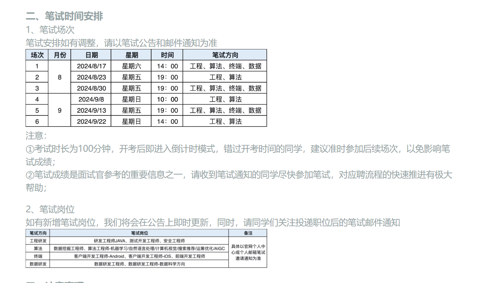

## 淘天
计算机视觉两个部门

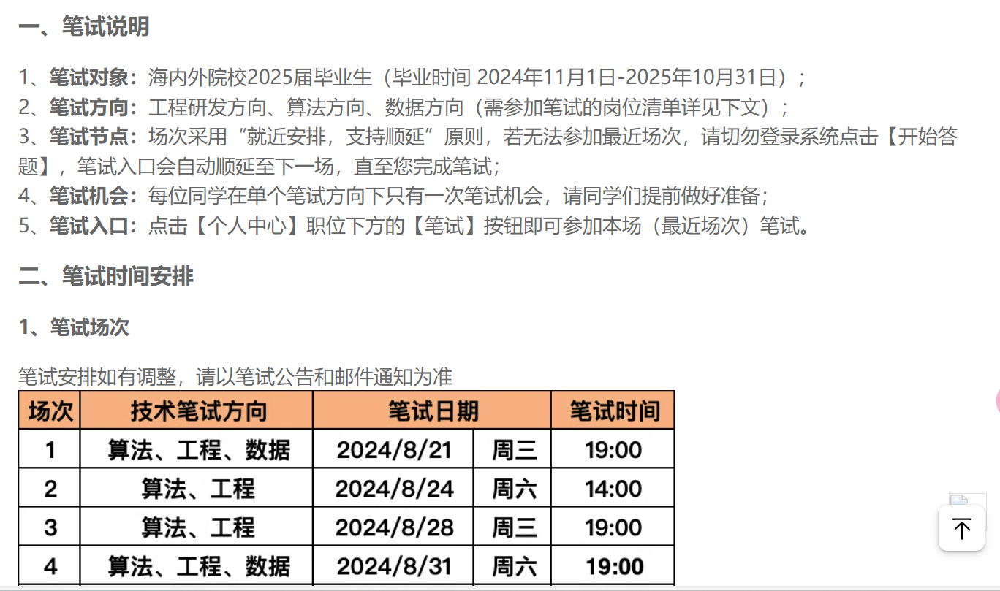

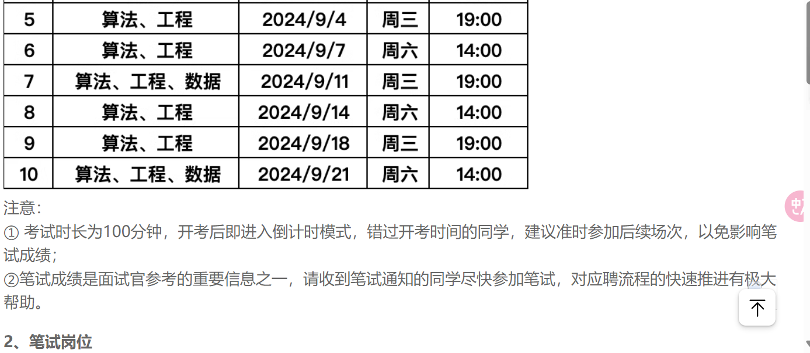

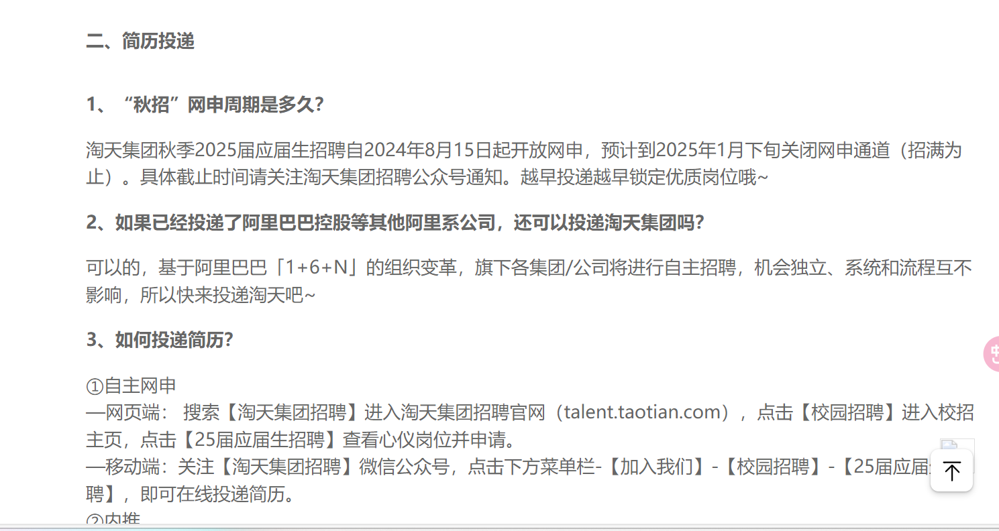

被骗了？ 感觉没有倒计时

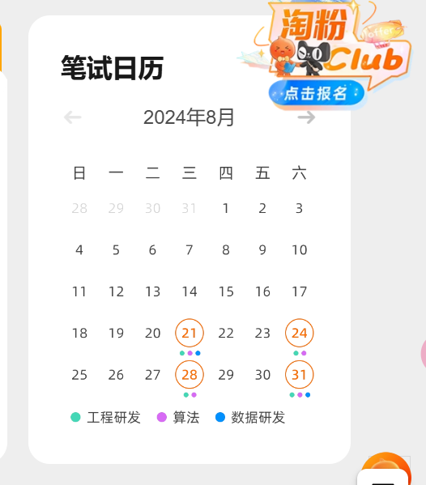

## 快手 全挂 这两个公司实习都不好进去呢
投了个普通的视频生成

## 字节 估计已经挂 只是卡在那里
图片 视频各一个

## 京东 大cv 测评先写 半小时 不知是否有用
已经妥协于测评了 825

## 拼多多 大算法 不投 
简历填写太傻逼 暂时不写 不投

连简历解析都直接不做了

联想也不搞

美团虽然做的垃圾但还做

## 没有应届生成岗位 联想 华为 
仅对硕士实习可能感兴趣

## 美团 无限复活
投AIGC视觉生成算法工程师

# 820
## 速腾聚创 多模态 牛客投 825简历不过
感谢您对RoboSense速腾聚创2025校园招聘多模态大模型开发工程师的关注， 您给我们留下了深刻的印象， 结合本次岗位的招聘需求匹配度，非常遗憾地通知您，暂无法为您推进下一步的流程。

中国电科智能研究院开始24届补录

## bili
投两个   
属于搜广推大组       

## 挚文集团 陌陌 探探
计算机视觉算法工程师

岗位描述
1、探索基于AIGC的视频/图像生成的前沿技术，重点聚焦于与人相关的生成方向；

2、参与以视频/图像生成技术为核心的创新产品和项目，负责技术落地实现；

3、汇总整理团队的技术成果，通过论文或技术报告形式进行输出。

## 巨人网络 游戏
牛客确实牛逼 只需要一个牛客页面的认证        
进入网站啥认证没有 直接搞定 因为直接企业合作吗？？

视觉算法工程师（25届秋招）

岗位职责
1、参与图像/视频/3D模型生成领域在游戏业务场景下的算法研发、落地，包括SD模型的训练、微调及应用、视频理解、数字人等；

2、参与图像/视频/3D内容生成与编辑，及视觉文本多模态算法创新与验证；

3、紧跟前沿技术、参与关键技术创新、突破与积累。

## 平安 暂不投 填太多
牛客也不能解析        
传统视觉

# 821
## vivo

AI大模型算法工程师（CV方向)-25届秋招

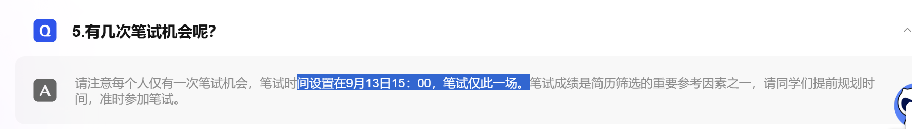

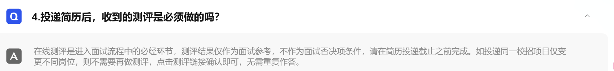

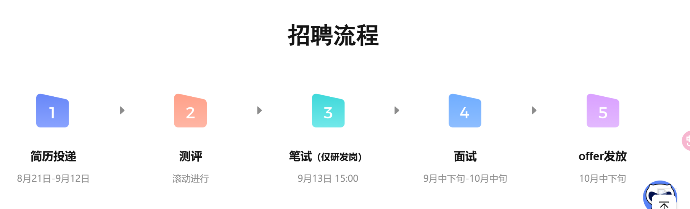

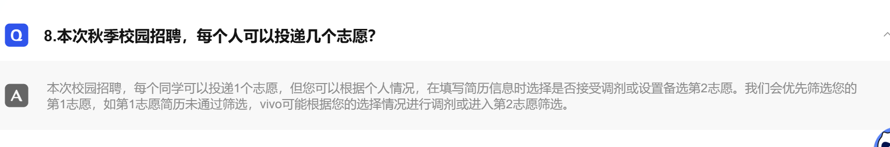

### 岗位说明

#### AI大模型算法工程师（CV方向)-25届秋招

工作职责
vivo AI研究院致力于研发业界领先的人工智能技术，通过AI技术创新持续为全球5亿+vivo用户带来无处不在的惊喜和激动人心的智慧体验。

在这里你将致力于：
1、负责AI大模型的研发和应用，包含多模型AI大模型的研发和系统优化；
2、负责AI大模型的数据建设、指令微调、偏好对齐、算法优化等工作，持续追求创新性和高效性；
3、负责AIGC相关应用的落地，包括图像创作、视频创作等，为用户带来超越预期的创造体验。
任职资格
1、硕士及以上学历，计算机、软件工程、人工智能等相关专业优先，具备扎实的算法基础和开发经验；
2、精通基础编程语言如C/C++或Python，有ACM/ICPC、NOI/IOI、Top Coder、Kaggle等竞赛优异的成绩者优先；
3、熟悉CV等AI算法和技术，有大模型训练、RL算法经验者优先；
4、具备大模型领域经验，具有一定规模和影响力的项目或论文者优先；
5、具有出色的问题分析和解决能力，能够深入解决大模型训练和应用存在的问题。

#### 图像/视频算法研发工程师（影像方向）-25届秋招

工作职责
我们是vivo影像团队，主要负责vivo手机拍照和视频从硬件到软件的整体解决方案。
我们以图像处理、计算机视觉、3D视觉、AI技术为依托，致力于让手机拍照更美、更清晰、更智能，通过打造具有行业竞争力的影像技术和产品，为消费者提供极致的影像体验。

在这里， 
你将与全球各地的影像领域专家一起工作，与行业一流的技术团队挑战顶尖的影像问题；
你将有机会接触到最新的图像、视觉、AI等相关技术，并使用这些技术打造出令人激动的产品；
你所编写的算法会运行在5亿+vivo智能终端设备上，用以提升用户拍照的体验；
你将与我们一起专注于攻克影像相关算法的难题，探索影像算法的发展方向。

你将与我们一起专注于：
1、根据公司对拍照和视频产品和技术的规划，设计并实现相应的图像处理、计算机视觉、3D视觉、AI技术等算法；
2、负责图像/视频算法的研发及效果和性能调优，提供行业领先的算法方案；
3、对相关领域的最新学术论文、行业、竞企等使用的图像技术进行长期的跟踪和梳理。
任职资格
1、硕士及以上学历，计算机或相关专业；
2、熟悉图像处理、计算机视觉、3D视觉、AI技术等相关知识；
3、优先考虑：具有生成类技术（GAN/AIGC等）、多模态大模型（理解/交互等）等科研经历；
4、具有扎实的数学功底和较强的算法实现能力，熟悉Python或C/C++，代码质量和风格良好；
5、严谨踏实，责任心强，条理清楚，善于学习总结，有良好的团队精神和沟通协调能力；
6、优选条件：
（1）具备熟练的英文文献阅读能力；
（2）发表过顶会高水平的图像、视觉、机器学习和模式识别等相关学术论文/专利；
（3）有图像/视频相关项目的开发经验；
（4）拥有模型加速训练经验，如多GPU分布式训练，CUDA编程经验等。

#### 影像效果测试开发工程师-25届秋招

工作职责
我们是vivo产品影像效果的代言人，致力于vivo产品的影像效果测试、质量提升和测试效能建设等工作。

在这里，
你将有机会负责相机和影像效果的测试工作；
你将有机会和团队一起，参与产品整个生命周期、发布过程中的技术创新；
你将需要运用自身的分析，对影像专业的理解及用户体验感知能力，发现或预知产品质量隐患与风险，为5亿+vivo用户的影像体验保驾护航。

你将与我们一起专注于：
1、参与产品策划、影像方向、设计实现的评审工作并提出改进建议；
2、参与质量目标制定和测试体系建设；
3、运用技术手段提升测试效率；
4、跟进用户反馈并回溯研发过程，不断提升产品质量。
任职资格

#### 图形图像开发工程师-25届秋招

工作职责
我们是vivo相册团队，你将接触最新的AI、影像技术并落地开发，同行业大牛们一起参与软件的设计和开发工作，致力于为5亿+手机用户提供极致的软件产品体验和服务。

你将与我们一起专注于：
1、参与Android APP软件研发工作，包括需求沟通，及功能设计与开发等工作；
2、参与软件产品的迭代改进、架构设计、性能调优、功耗优化、体验优化等工作；
3、和产品/测试/运营进行密切沟通，根据开发需求提出合理的技术方案；
4、参与软件开发过程中的问题分析和总结，提供建议并帮助改善研发流程。
任职资格
1、本科及以上学历，计算机、软件、通信、电子等相关专业；
2、热爱编程，具备扎实的数据结构、基础算法、数据库、计算机原理、网络协议等知识；
3、熟练掌握至少一门编程语言，包括但不限于：Java、C、C++，并有良好的编程习惯；
4、熟悉面向对象设计的方法，熟悉网络编程，熟练掌握常用的设计模式；
5、有Android相关开发经验者优先。

#### 图像处理工程师-25届秋招

工作职责
我们是vivo影像团队，主要负责vivo手机Camera模块从硬件到软件的整体解决方案。 
我们以图像处理、计算机视觉、AI技术为依托，致力于让手机拍照“更美”、“更清晰”、“更智能”，通过打造具有行业竞争力的影像技术和产品，为消费者提供极致的影像体验。 

在这里， 
你将与全球各地的影像领域专家一起工作，与行业一流的技术团队挑战顶尖的影像问题； 
你将有机会接触到最新的图像、视觉、机器学习等相关技术，并使用这些技术打造出令人激动的产品； 
你所做的影像效果提升工作会运行在5亿+vivo智能终端设备上，用以提升用户拍照的体验； 
你将与我们一起专注于攻克影像相关算法的难题，探索影像算法的发展方向；
你可以学习到整个影像效果系统各个模块是如何工作，我们提供广阔的学习机会及职业选择。 

你将与我们一起专注于： 
1、负责图像质量整体解决方案设计与研发，包含图像算法的研发，效果设计与调优，系统设计与实现，仿真开发与应用等，其中具体涉及内容有图像信号处理ISP（image signal processor)模块的设计开发及效果调优，3A（AWB/AE/AF )模块算法，系统和效果开发，denoise/sharpness、HDR、superNight，LTM等基础图像处理算法开发及迭代升级等，以最佳影像质量为目标，构建最优系统框架，并且开发图像仿真系统； 
2、负责手机摄像头产品和技术规划，图像质量的调优； 
3、负责手机摄像头新功能的预研开发，负责新功能新卖点在项目中的落地；
4、对相关领域的最新学术论文、行业、竞争对手等使用的图像技术进行长期的跟踪和梳理。

## itc传统cv
广东保伦电子股份有限公司

15k * 13

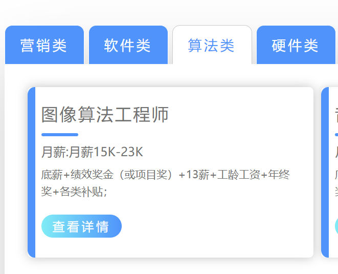

## 华为  卡住
算法工程师 媒体算法

这个不行 但也申请了
ai工程师 大cv

# 822
## 高德地图 失败 要求太高 过不了简历 不需要再尝试
aigc

# 823
## 商汤 计算机视觉研究员校园招聘职位25届AI领航员
有点不太可能     
该公司岗位普遍要求高

# 824
## 37互娱
https://app.mokahr.com/campus_apply/37/25238#/job/736cc904-54d7-4b45-9fd5-76d314ec9494

## shopee

第 1 志愿
（25届秋招）算法-计算机视觉/多模态内容理解-深圳

https://app.mokahr.com/campus-recruitment/shopee/2962?sourceToken=1d70d3a2c4d1134f8c2ee537825e91ec#/candidateHome/applications

卡初筛 827
## 贝壳找房 最爱公司 只需要上传附件

aigc

自如不搞 回归本质

安居客连官方招聘网站都没有
## 得物 大cv 快且有诚意

# 825
## 海康 投不了 太傻逼 简历保存不了投不了。真傻逼 系统问题吗？连chrome也保存不了

bug在于生日他自己填错

太傻逼 第二项有保存不了

太傻逼

坚决不再投 已经试了三次

# 827 
## 联通 投四个

## 电信
投一个 比较难操作

## 三星

# 828 
## shein
第一次看见comfy

## tme
## 金山
这些广东公司都用moka

## 寒武纪
# 829
## 美的 只能投一个
## 小红书秋招

# 不需要投的

829       
酷家乐 moka投递失败       
携程好像都是nlp     
电信天翼云大AI 最多到nlp

社招是最热情的        
随时很多贴出来       

研究员部分欢迎

顺丰没有

现在nlp确实火 有头有脸的都要插一脚

同花顺没开?看不懂 只有人才计划

旷视没有解析 登录自动退出 不投

汇川技术只有传统cv 解析不好 不投

用友只有Nlp

去哪儿回归本质 搜推 只招aigc实习 估计现在也快倒了

菜鸟传统cv 物流

pmo

职位描述
1、负责项目从立项到收尾完整的项目全生命周期管控，用专业的项目过程管理确保项目过程可跟踪；
2、负责项目过程和结果指标数据度量和运营，提升项目数据准确性；
3、负责项目风险控制、及时发现跟踪解决影响项目进度相关问题，积极推动与解决；
4、总结并沉淀相关项目管理实战经验，赋能项目和团队，提升整体效率。
职位要求
1、计算机、通信或相关专业背景；
2、精通软件项目过程管理，对项目管理等有实际应用经验及深刻理解，有一定数据分析能力；
3、具有大局观，能有效的控制项目目标的达成。工作细致，思维敏捷，责任感强，工作积极主动，具有快速学习能力及应对快速变化的能力；
4、具有丰富的沟通、交流和组织能力，出色的团队合作精神。

蚂蚁都不知道怎么投 没有地方投

## 小米现在823还是未来星计划 没开
## 美的 博士研究员 估计不想招多少
## 阿里云有生成 简历一直说没填完整 傻逼无法提交
其他部门去了感觉也被裁

## 机器人公司基本是基础cv和nlp

## 更传统的就是金融 小公司等 基本是java前后端

## 京东 拼多多 唯品会 都没有图片视频校招hc
第一个可能有         
但是他们都是合一块搞

美团也不搞。只招生成研究员 top计划

拼多多主打管培生    
回归本质        

联想也不搞

华为竟然也只有nlp，应届。其实天才少年还是在搞这块

感觉应届都得创业公司搞去了

阿里国际回归本质 只招品牌专员

## 米哈游只有多模态基础，3d生成需要研究员
## 电信天翼云只有传统cv

## 商汤 ai先锋顶尖

先锋课题：面向端侧部署的通用图像生成模型技术研究算法研究类 

https://hr.sensetime.com/SU6522677e1c240e3d6825d64c/pb/posDetail.html?postId=668775a91c240e3d86dba479&postType=campus

先锋课题：图像生成算法的关键技术研究与应用算法研究类 

    任职要求
    1. 熟练掌握python等脚本编程语言与pytorch等常用深度学习框架；
    2. 掌握计算机视觉和图像处理基本算法、常用深度学习算法，在如下一个或多个相关方向有深入研究：GAN、扩散模型、图像生成、多模态生成、多模态理解等；
    3. 在国际顶会或期刊（例如：CVPR, ICCV, ECCV, NeurIPs,ICML等）发表过论文或在国际知名视觉竞赛中获得优异成绩；
    4. 具有良好的沟通能力，和良好的团队合作精神。

https://hr.sensetime.com/SU6522677e1c240e3d6825d64c/pb/posDetail.html?postId=6686abfc1c240e3d86d978cb&postType=campus

2019年，商汤启动“AI先锋”计划，以课题制的形式，面向全球高校招募致力于AI领域探索的优秀青年人才。对成功入选该计划的人才，公司将给予最大的资源支持和研发自主权，助力其以敢为天下先的精神，攻克人工智能领域世界级的技术难题。

## 字节 筋斗云人才

大厂 我也没有卡的

几乎全是博士

AI科学计算研究员-ByteDance Research-筋斗云人才计划

课题介绍：
我们使用深度学习、量子嵌入、量子计算等前沿方法对多电子系系统进行物理学第一性原理建模，精确计算分子及晶体的电子结构、以及其他物理化学特性，实现新一代的物理化学技技术
领域优势：我们的团队在多个前沿领域深耕多年，包括基于深度学习的第一性原理计算方法和基于量子嵌入的多尺度高精度计算方法。相关研究工作在领域内获得了广泛影响与认可，成果发表在《自然》子刊、Chemical Science、PRL、npj Comput. Mater等国际顶级期刊。团队氛围务实开放，既融入了学界自由讨论和探索的风气，又结合了业界快速迭代和追求极致的理念。我们与国内外多所科研院校紧密合作，共同探索量子科学的边界。

职位要求
1、2025届获得博士学位，物理、化学、数学、机器学习等相关专业；
2、有量子物理、量子化学或机器学习相关领域的研究经验；
3、有扎实数学基础及编程能力。

    1、AML负责给字节跳动提供大规模机器学习的算力，算法团队负责探索算法和系统的CoDesign，对推荐广告模型进行Deep & Wider的超大规模复杂化，例如模型Scaling Law探索、文本/ID生成式推荐、用户超长序列端到端建模、混合精度优化等；
    2、参与抖音、今日头条等产品中的机器学习算法应用与优化，包括推荐、广告、多模态等需要利用大量算力的地方；
    3、和工程团队密切配合，探索新的架构下新的算法。

职位描述：
1、负责开发和优化视觉大模型推理框架，通过编译优化、并行计算优化、图融合、高效 CUDA 算子开发、低精度计算、高并发服务请求优化等高性能优化技术打造业界领先的多模态理解、AIGC推理引擎；
2、负责视觉大模型（多模态理解、 AIGC）训练优化算法研究和落地，通过数据并行、模型并行、Pipeline并行、通信优化等基于 CUDA 的分布式训练框架大幅提升模型的训练速度与效率；
3、与公司各算法部门深度合作，分析业务性能瓶颈，通过软硬结合的方式，高效部署与优化多模态理解、AIGC核心业务模型，落地到字节各产品线，投入AI工具链开发及技术生态的建设，支撑字节AI方向重要业务的发展。

# 是否投目标检测岗
我其实还想转去生视频 生3d呢

符合的企业 岗位 确实也少

# 难点
## 代码过不了 太难    
acm模式 仍需读取终端输入

    import sys

    #读取一行
    #strip()函数用于去除输入行末尾的换行符和空格
    input_data = sys.stdin.readline().strip()

    #列表中存放字符串
    input_list = input_data.split() # 其实没必要 strip()

    # 一次性转成int
    numbers = list(map(int,input_data.split()))
    #虽然对象是list,但是经过map以后不是list，需要再转成list

    #循环读取行
    #这个为什么不需要去掉换行符
    for line in sys.stdin:
        input_list = line.split()

split()使用空格作为分隔符

    使用自定义分隔符
    python
    复制代码
    text = "apple,banana,cherry"
    fruits = text.split(',')
    print(fruits)
    # 输出: ['apple', 'banana', 'cherry']
    使用多字符分隔符
    python
    复制代码
    text = "one--two--three"
    numbers = text.split('--')
    print(numbers)
    # 输出: ['one', 'two', 'three']

## 不会要手写ddim吧？
然后手推公式？       
然后横向大对比？？？

# 结尾